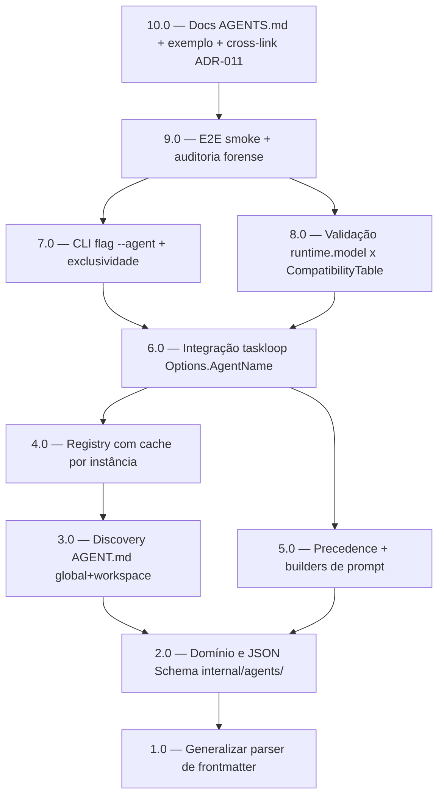

<!-- spec-hash-prd: a358518c8d5309b2420e56f2bb4d2e4261fe2accf956f33fafbcf0f32882187d -->
<!-- spec-hash-techspec: fe72adf8729a1e396dcf769e664dd2502af6588439174491a65ea7b5d4a3fb09 -->

# Resumo das Tarefas de Implementação para Agent Registry Declarativo

## Metadados
- **PRD:** `.specs/prd-agent-registry-declarativo/prd.md`
- **Especificação Técnica:** `.specs/prd-agent-registry-declarativo/techspec.md`
- **ADR Material:** `.specs/adr/011-agent-registry-declarativo.md`
- **Total de tarefas:** 10
- **Tarefas paralelizáveis:** 4.0 ↔ 5.0; 7.0 ↔ 8.0

## Tarefas

| # | Título | Status | Dependências | Paralelizável | Skills |
|---|--------|--------|--------------|----------------|--------|
| 1.0 | Generalizar parser de frontmatter (ParseFrontmatterFields) | done | — | — | — |
| 2.0 | Domínio e JSON Schema do package internal/agents/ | done | 1.0 | — | — |
| 3.0 | Discovery de AGENT.md em escopo global + workspace | done | 2.0 | — | — |
| 4.0 | Registry com cache por instância | done | 3.0 | Com 5.0 | — |
| 5.0 | Precedence runtime + builders de prompt do agente | done | 2.0 | Com 4.0 | — |
| 6.0 | Integrar Options.AgentName e BuildPromptContext no taskloop | done | 4.0, 5.0 | — | — |
| 7.0 | Adicionar flag CLI --agent com validação de exclusividade | done | 6.0 | Com 8.0 | — |
| 8.0 | Validar runtime.model contra CompatibilityTable | done | 6.0 | Com 7.0 | — |
| 9.0 | E2E smoke + auditoria de invariantes forenses | done | 7.0, 8.0 | — | — |
| 10.0 | Documentação AGENTS.md + exemplo AGENT.md + cross-link ADR-011 | pending | 9.0 | — | — |

## Dependências Críticas

- **1.0 é gate de regressão para skills**: a extração de `ParseFrontmatterFields` deve manter a suíte de `internal/skills/` 100% verde antes de qualquer mudança em `internal/agents/`. R-01 do techspec exige esta sequência.
- **2.0 é precondição para todas as outras**: define o contrato (`ResolvedAgent`, `Metadata`, `RuntimeDefaults`, `Scope`) usado em 3.0, 4.0, 5.0.
- **6.0 acopla Discovery+Registry (4.0) e Precedence+Prompt (5.0) ao taskloop**: é o ponto onde o fluxo legado `--tool` ganha o caminho opt-in `--agent`. Diff em `internal/runtime/persistence/*` e `internal/runtime/watchdog.go` deve ser zero.
- **9.0 é o gate final**: T-22 valida que artefatos forenses (`events.jsonl`, `tool_calls.md`, `execution_report.md`) e watchdog permanecem idênticos ao fluxo legado quando `--agent` é usado.

## Riscos de Integração

- **Consolidação de 11 passos → 10 tasks**: o techspec lista 11 itens em "Sequenciamento de Desenvolvimento", mas o passo 11 (cross-link ADR-011) foi absorvido pela tarefa 10.0 (documentação). ADR-011 já foi criado durante `create-technical-specification`; a tarefa 10.0 apenas garante que `AGENTS.md` referencia o novo ADR e o exemplo canônico de `AGENT.md`.
- **Refator de parser compartilhado (1.0)**: alta blast radius se executado sem suíte de skills verde. Tarefa carrega gate explícito de regressão.
- **Diff zero em persistência forense e watchdog**: critério guarda-rail aplicado em todas as tarefas que tocam `internal/taskloop/*` ou `cmd/ai_spec_harness/*` (6.0, 7.0, 9.0). Falha desse critério bloqueia a tarefa.
- **Paralelismo 4.0↔5.0**: tarefas tocam arquivos disjuntos (`registry.go` vs `precedence.go`+`prompt.go`), ambas dependendo apenas de tipos definidos em 2.0. Execução paralela é segura.
- **Paralelismo 7.0↔8.0**: tarefas tocam arquivos disjuntos (`cmd/ai_spec_harness/task_loop.go` vs `internal/agents/schema.go`/validação), ambas dependendo apenas de 6.0 ter exposto o ponto de integração.
- **Cobertura cross-CLI futura (multi-IDE via ACP)**: ficou fora desta fase. Os 22 testes cobrem apenas o cenário `runtime.ide=claude` no caminho ACP; `codex/gemini/copilot` continuam roteados via CLI invokers existentes.

## Cobertura de Requisitos

| Tarefa | Requisitos cobertos | Casos de teste (techspec) |
|--------|---------------------|---------------------------|
| 1.0 | RF-04, suposição A3 | T-22 |
| 2.0 | RF-04, RF-05, RF-06, RF-07, RF-08 | T-05, T-06, T-07, T-08, T-09 |
| 3.0 | RF-01, RF-02, RF-03 | T-01, T-02, T-03, T-04 |
| 4.0 | RF-10, RF-17, RF-18 | T-14, T-19 |
| 5.0 | RF-13, RF-15, RF-16 | T-10, T-11, T-12, T-15, T-16 |
| 6.0 | RF-12, RF-14, RF-15, RF-19, RF-20 | T-17, T-18 |
| 7.0 | RF-11 | T-20, T-21 |
| 8.0 | RF-09 | T-13 |
| 9.0 | RF-19 (auditoria final) | T-22 + suíte completa |
| 10.0 | (documentação; sem RF direto) | — |

## Grafo de Dependencias

## Legenda de Status
- `pending`: aguardando execução
- `in_progress`: em execução
- `needs_input`: aguardando informação do usuário
- `blocked`: bloqueado por dependência ou falha externa
- `failed`: falhou após limite de remediação
- `done`: completado e aprovado
