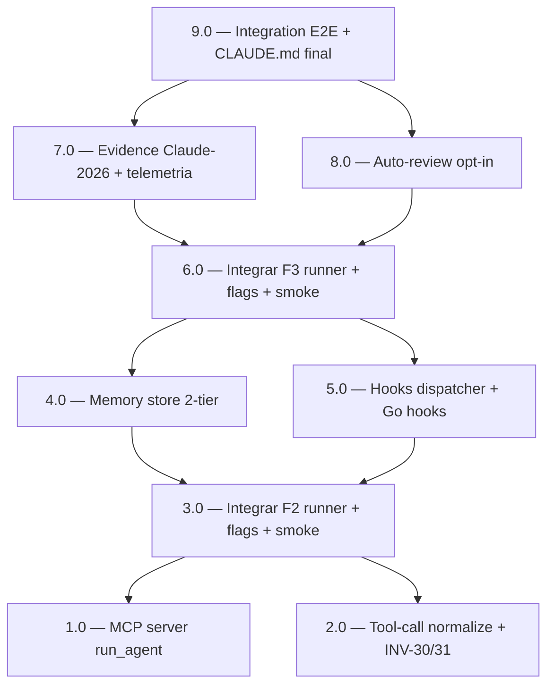

<!-- spec-hash-prd: a6165cdba4dfa8bb0103b74537f64e2230b31251b6cd45cc9db37237cc698796 -->
<!-- spec-hash-techspec: f2fe77d08555ce9fd844b9fca0cf66ce85cc35d460ade040122ad2dedb9212d5 -->

# Resumo das Tarefas de Implementação para Claude-CLI 2026 (Paridade Compozy)

## Metadados
- **PRD:** `.specs/prd-claude-cli-acp-2026/prd.md`
- **Especificação Técnica:** `.specs/prd-claude-cli-acp-2026/techspec.md`
- **ADR:** `.specs/adr/014-claude-cli-acp-native.md`
- **Total de tarefas:** 9
- **Tarefas paralelizáveis:** 1.0+2.0 (F2 skeleton); 4.0+5.0 (F3 skeleton); 7.0+8.0 (F4+F5)

## Tarefas

| # | Título | Status | Dependências | Paralelizável | Skills | Fase |
|---|--------|--------|-------------|---------------|--------|------|
| 1.0 | MCP server reservado com tool `run_agent` (skeleton + spawn engine) | done | — | Com 2.0 | — | F2 |
| 2.0 | Tool-call normalization driver-aware + invariantes INV-30/INV-31 | done | — | Com 1.0 | — | F2 |
| 3.0 | Integrar MCP + normalize no runner.go, flags CLI F2 + smoke E2E + CLAUDE.md | done | 1.0, 2.0 | Não | `object-calisthenics-go` | F2 |
| 4.0 | Memory store 2-tier (internal/runtime/memory/) com limites configuráveis | done | 3.0 | Com 5.0 | — | F3 |
| 5.0 | Hooks dispatcher + 6 pontos canônicos + governance/token_budget Go hooks | done | 3.0 | Com 4.0 | — | F3 |
| 6.0 | Integrar memory + hooks no runner.go, flags F3 + smoke F3 | done | 4.0, 5.0 | Não | `object-calisthenics-go` | F3 |
| 7.0 | Evidence Claude-2026 (cache/thinking) + telemetria opt-in estendida | done | 6.0 | Com 8.0 | — | F4 |
| 8.0 | Auto-review opt-in via skill local + hook session.post_review | done | 6.0 | Com 7.0 | — | F5 |
| 9.0 | Integration E2E cross-wave + CLAUDE.md final + smoke F5 | done | 7.0, 8.0 | Não | — | F5 |

## Dependências Críticas

- **3.0 bloqueia toda wave F3+**: integração no `runner.go` introduz o pipeline que tasks F3+ ampliam (memory.Read + hooks.Dispatch antes de `c.Open`). Sem 3.0 entregue, as integrações 4.0/5.0 ficam órfãs.
- **6.0 bloqueia F4 e F5**: enriquecimento de evidence (7.0) e auto-review (8.0) consomem o hook `session.post_end` introduzido em 5.0 e ativado em 6.0.
- **9.0 é gate cross-wave**: valida integração entre todas as features. Falha em 9.0 indica regressão em 1.0..8.0 — não pode ser pulada.
- **Tasks 3.0 e 6.0 não podem rodar em paralelo entre si**: ambas tocam `internal/runtime/runner.go` na mesma região (linhas 89-220). Merge conflict garantido.
- **`coder/acp-go-sdk v0.6.3` permanece pinado** durante toda execução. Mudança de versão exige nova ADR + tasks.

## Riscos de Integração

- **MCP-SDK Go imatura em 2026-Q2** — task 1.0 precisa decidir entre lib externa vs vendor minimal. Documentar no `task-1.0` execution_report.md.
- **Shell hooks `.claude/hooks/*.sh` vs Go hooks** — task 5.0 introduz Go hooks coexistindo com shell. Precedência: Go hooks rodam quando ACP é orchestrator; shell hooks continuam em modo interativo Claude Code. Risco de confusão para contribuidores — task 9.0 deve documentar no `CLAUDE.md`.
- **Memória 2-tier vs auto-memory Claude Code** — task 4.0 introduz `.specs/<prd>/memory/`. Auto-memory de Claude Code (`~/.claude/projects/.../memory/`) coexiste; precedência: harness vence quando dir local existe.
- **MCP recursão infinita** — task 1.0 implementa `maxDepth=3`; task 9.0 valida com teste E2E (INV-31).
- **Auto-review dobra custo tokens** — task 8.0 é opt-in default-off; documentar trade-off em `CLAUDE.md` (task 9.0).
- **Parity invariants ADR-008** — task 2.0 adiciona INV-30/INV-31. Falha em qualquer um dos 29 invariantes existentes durante execução bloqueia a wave inteira (regra hard ADR-008).
- **`runner.go` cresceu para >300 LoC após F1-Codex** — tasks 3.0 e 6.0 podem precisar refatoração; daí o uso de `object-calisthenics-go` nessas tarefas.
- **Cobertura ≥ 70% global; ≥ 80% em subpacotes novos (mcpserver/, memory/, hooks/)** — falha de cobertura bloqueia mergeo da task.

## Cobertura de Requisitos

| Tarefa | Requisitos cobertos |
|--------|-------------------|
| 1.0 | RF-01 (RF-01.1, RF-01.2, RF-01.3, RF-01.4, RF-01.5, RF-01.6) |
| 2.0 | RF-02 (RF-02.1, RF-02.2, RF-02.3, RF-02.4, RF-02.5) |
| 3.0 | RF-01 + RF-02 (integração + flags + smoke) |
| 4.0 | RF-03 (RF-03.1, RF-03.2, RF-03.3, RF-03.5, RF-03.6) |
| 5.0 | RF-04 (RF-04.1, RF-04.2, RF-04.3, RF-04.4, RF-04.5, RF-04.6, RF-04.7) |
| 6.0 | RF-03 + RF-04 (RF-03.4, RF-03.7, RF-04.8 — integração runner + flags + smoke) |
| 7.0 | RF-05 (RF-05.1, RF-05.2, RF-05.3, RF-05.4) |
| 8.0 | RF-06 (RF-06.1, RF-06.2, RF-06.3, RF-06.4, RF-06.5, RF-06.6, RF-06.7) |
| 9.0 | C-01..C-10 (critérios cross-wave: parity, cobertura, smoke E2E, `CLAUDE.md` final) |

## Grafo de Dependencias

## Legenda de Status
- `pending`: aguardando execução
- `in_progress`: em execução
- `needs_input`: aguardando informação do usuário
- `blocked`: bloqueado por dependência ou falha externa
- `failed`: falhou após limite de remediação
- `done`: completado e aprovado
