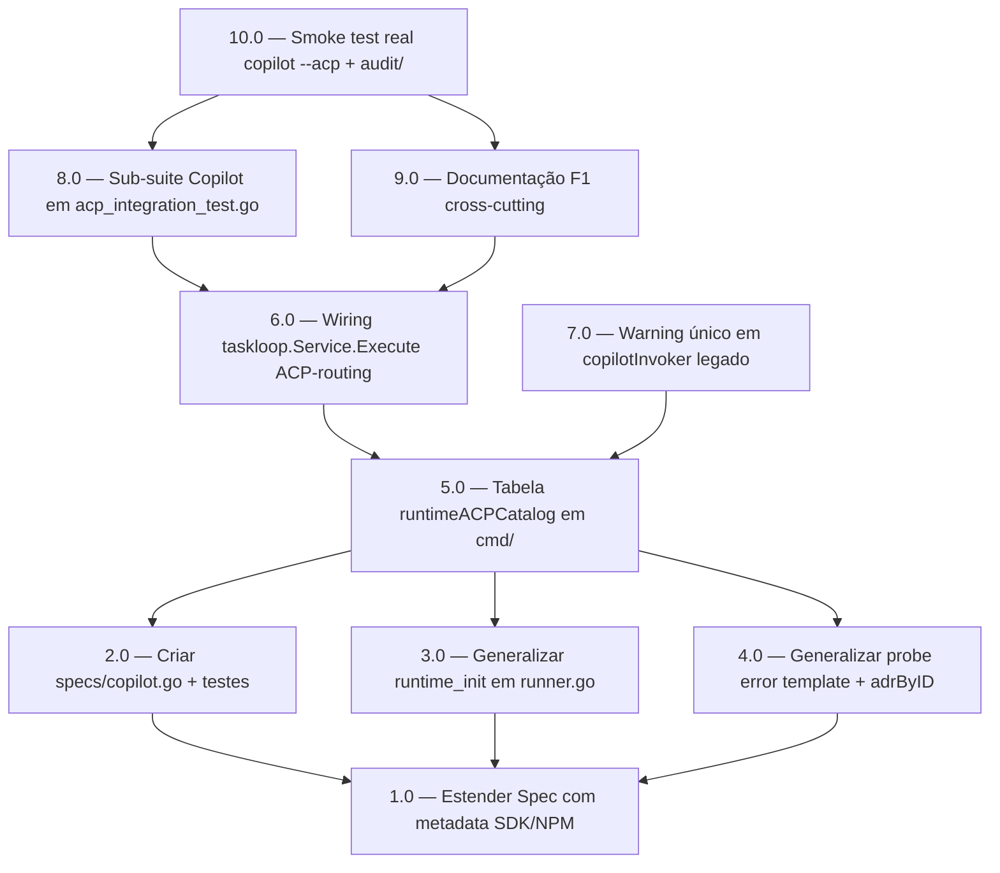

<!-- spec-hash-prd: 6403512031b8bc89a981456643d779a6e3fe84021554651ee1c88c2573f7a1b4 -->
<!-- spec-hash-techspec: d9f08e6fe9b06da04c206d907b3587bb6b3e37358c9da46aae8b50b764e4a236 -->

# Resumo das Tarefas de Implementação para Copilot CLI via ACP Nativo

## Metadados
- **PRD:** `.specs/prd-copilot-acp-spec/prd.md`
- **Especificação Técnica:** `.specs/prd-copilot-acp-spec/techspec.md`
- **ADR material:** `.specs/adr/012-copilot-cli-acp-native.md` (substitui ADR-007)
- **Insumo de pesquisa:** `docs/research/compozy-adaptation-copilot-2026.md`
- **Total de tarefas:** 10
- **Tarefas paralelizáveis:** 2.0 ↔ 3.0 ↔ 4.0 (após 1.0); 6.0 ↔ 7.0 (após 5.0)

## Tarefas

<!-- Colunas e formato canônico (MANDATÓRIO):
     - `#`: id decimal `X.Y` (sempre X.0 para tarefas de topo).
     - `Status`: ^(pending|in_progress|needs_input|blocked|failed|done)$
     - `Dependências`: ^(—|\d+\.\d+(,\s*\d+\.\d+)*)$  (em-dash unicode quando vazio)
     - `Paralelizável`: ^(—|Não|Com\s+\d+\.\d+(,\s*\d+\.\d+)*)$
     - `Skills`: skills processuais extras (descoberta agnóstica em `.agents/skills/`). Use `—` quando
       não houver. Nunca listar skills auto-carregadas (governance/linguagem) nem `*-implementation`.
     - `Fase` (OPCIONAL): inteiro positivo para agrupamento visual de fases de entrega. Pode ser
       omitida em PRDs pequenos; `execute-all-tasks` não consome esta coluna. Se incluída, mantenha
       em todas as linhas para não quebrar o parser de tabela markdown. -->

| # | Título | Status | Dependências | Paralelizável | Skills |
|---|--------|--------|--------------|---------------|--------|
| 1.0 | Estender Spec value object com metadata SDK/NPM | done | — | — | — |
| 2.0 | Criar specs/copilot.go com construtor e testes | done | 1.0 | Com 3.0, 4.0 | — |
| 3.0 | Generalizar runtime_init em runner.go (deixar de hardcodar Claude) | done | 1.0 | Com 2.0, 4.0 | — |
| 4.0 | Generalizar probe error template + tabela adrByID | done | 1.0 | Com 2.0, 3.0 | — |
| 5.0 | Tabela runtimeACPCatalog em cmd/ai_spec_harness/task_loop.go | done | 2.0, 3.0, 4.0 | Não | — |
| 6.0 | Wiring taskloop.Service.Execute para roteamento ACP por tool | done | 5.0 | Com 7.0 | — |
| 7.0 | Aviso único de depreciação no copilotInvoker legado (sync.Once) | done | 5.0 | Com 6.0 | — |
| 8.0 | Sub-suite Copilot em acp_integration_test.go reusando fake server | done | 6.0 | — | — |
| 9.0 | Documentação F1 cross-cutting (COPILOT.md, AGENTS.md, ADR-007, telemetria, cli-schema) | done | 6.0 | — | — |
| 10.0 | Smoke test real copilot --acp + captura audit/ | done | 8.0, 9.0 | — | — |

## Dependências Críticas

- **1.0 é gate de regressão para Claude**: estender `Spec` value object e atualizar `claude.go` para nova assinatura de `newSpec` antes de qualquer outra mudança. Risco R-01 do techspec exige esta ordem. T-05 (regressão Claude) deve passar 100% antes de avançar.
- **5.0 é precondição cirúrgica do wire-up**: `runtimeACPCatalog` é o ponto de roteamento ACP por tool. Sem ela, 6.0 e 7.0 não têm catálogo a consumir; o gating literal `"claude"` em `task_loop.go:77` continuaria bloqueando Copilot.
- **6.0 carrega invariante crítica**: `Service.Execute` ganha branch ACP para Copilot. **Diff zero** obrigatório em `internal/runtime/persistence/*`, `internal/runtime/watchdog.go`, `internal/runtime/client/*`. Risco R-08 (crítico do techspec) exige revisão obrigatória do diff antes de avançar para 8.0.
- **8.0 é gate de paridade observacional**: reusa o fake ACP server existente (`internal/runtime/client/client_test.go`) para validar que `events.jsonl`, `tool_calls.md`, `execution_report.md` saem com a mesma estrutura que Claude (T-10/T-11/T-12).
- **10.0 é gate final E2E**: smoke real com `copilot --acp` produz evidência forense em `audit/`. Sem isso, paridade observacional não está validada fora do fake server.

## Riscos de Integração

- **R-08 (crítico)**: quebra silenciosa de invariantes forenses ao mudar `runner.go:113-120`. Tarefas 3.0 e 6.0 carregam revisão obrigatória do diff em `internal/runtime/persistence/*` e `internal/runtime/watchdog.go` (deve ser **zero linhas**). Falha desse critério bloqueia merge.
- **R-01**: regressão Claude ao estender `newSpec` signature. Tarefa 1.0 carrega gate explícito: `internal/runtime/specs/claude_test.go` 100% verde antes de avançar para 2.0/3.0/4.0.
- **Constantes pendentes (Q1/Q4 do PRD)**: `CopilotNpmVersion` e `CopilotMinCLIVersion` são placeholders no techspec. Tarefa 2.0 deve confirmá-las via `npm view @github/copilot versions` e release notes do GitHub Copilot CLI **antes de mergear** — falha aqui não bloqueia desenvolvimento mas bloqueia merge (status muda para `needs_input` se confirmação demorar).
- **Paralelismo 2.0 ↔ 3.0 ↔ 4.0**: arquivos disjuntos (`specs/copilot.go`, `runtime/runner.go`, `runtime/probe/probe.go`); todas dependem apenas de 1.0. Seguro paralelizar; risco é coordenar testes integrados em 8.0.
- **Paralelismo 6.0 ↔ 7.0**: arquivos disjuntos (`internal/taskloop/taskloop.go` vs `internal/taskloop/agent.go`); ambas dependem de 5.0 ter exposto o catálogo. Seguro paralelizar.
- **Caminho legado preservado por uma versão**: `copilotInvoker` em `internal/taskloop/agent.go:381-388` permanece operacional via decisão Q5 do PRD (2 versões minor). Tarefa 7.0 garante warning único; remoção é decisão de versão futura, fora deste PRD.
- **Smoke test (10.0) requer `copilot` CLI instalado**: ambiente de CI atual pode não tê-lo. Smoke é manual; CI cobre apenas matriz com fake server (8.0).

## Cobertura de Requisitos

| Tarefa | Requisitos cobertos | Casos de teste (techspec) |
|--------|---------------------|---------------------------|
| 1.0 | RF-04 (preparação), preserva A5, A6 | T-05, T-19 |
| 2.0 | RF-01, RF-02, RF-03, RF-11 | T-01, T-02, T-03, T-04 |
| 3.0 | RF-04 | T-05, T-09 |
| 4.0 | RF-05, RF-18 | T-06, T-07, T-08, T-20, T-21 |
| 5.0 | RF-06, RF-07 | T-13, T-14, T-15 |
| 6.0 | RF-08, RF-12, RF-17 | T-16, T-22, T-23, T-24 |
| 7.0 | RF-09 | T-17, T-18 |
| 8.0 | RF-10, RF-21 | T-10, T-11, T-12 |
| 9.0 | RF-13, RF-14, RF-15, RF-16, RF-19, RF-20 | — (validação documental) |
| 10.0 | RF-12 (gate final), OB-02, OB-05 | smoke manual + suíte completa |

## Grafo de Dependencias

## Legenda de Status
- `pending`: aguardando execução
- `in_progress`: em execução
- `needs_input`: aguardando informação do usuário
- `blocked`: bloqueado por dependência ou falha externa
- `failed`: falhou após limite de remediação
- `done`: completado e aprovado
