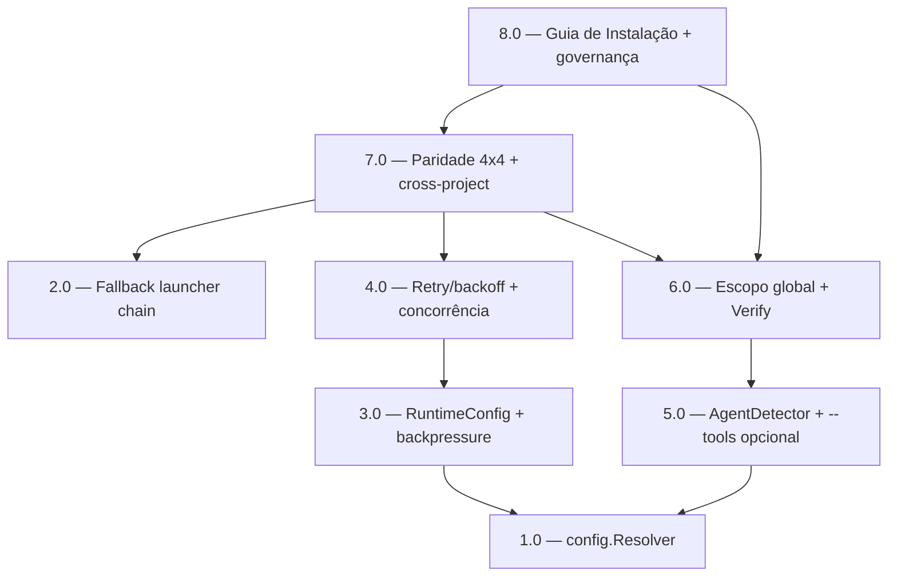

<!-- spec-hash-prd: af3468061964d963ab6d18795514e4063438208b7f929baea5b62ae35dea160a -->
<!-- spec-hash-techspec: e73cd67feb46efd6386ea72d4d008cc84efce2e4080ae239ea9f21a0fce25e37 -->

# Resumo das Tarefas de Implementação para Fundação Portátil do ai-spec-harness

## Metadados
- **PRD:** `.specs/prd-fundacao-portatil/prd.md`
- **Especificação Técnica:** `.specs/prd-fundacao-portatil/techspec.md`
- **Total de tarefas:** 8
- **Tarefas paralelizáveis:** {1.0 ‖ 2.0}, {3.0 ‖ 5.0}, {4.0 ‖ 6.0}

## Tarefas

<!-- Colunas e formato canônico (MANDATÓRIO):
     - `#`: id decimal `X.Y` (sempre X.0 para tarefas de topo).
     - `Status`: ^(pending|in_progress|needs_input|blocked|failed|done)$
     - `Dependências`: ^(—|\d+\.\d+(,\s*\d+\.\d+)*)$  (em-dash unicode quando vazio)
     - `Paralelizável`: ^(—|Não|Com\s+\d+\.\d+(,\s*\d+\.\d+)*)$
     - `Skills`: skills processuais extras (descoberta agnóstica em `.agents/skills/`). Use `—` quando
       não houver. Nunca listar skills auto-carregadas (governance/linguagem) nem `*-implementation`.
     - `Fase` (OPCIONAL): inteiro positivo para agrupamento visual de fases de entrega. Pode ser
       omitida em PRDs pequenos; `execute-all-tasks` não consome esta coluna. Se incluída, mantenha
       em todas as linhas para não quebrar o parser de tabela markdown. -->

| # | Título | Status | Dependências | Paralelizável | Skills |
|---|--------|--------|-------------|---------------|--------|
| 1.0 | config.Resolver — hierarquia global+projeto, upward-walk, precedência | done | — | Com 2.0 | — |
| 2.0 | Fallback launcher chain genérico (remove npx-only) | done | — | Com 1.0 | — |
| 3.0 | RuntimeConfig unificado + sessão ACP observável (backpressure) | done | 1.0 | Com 5.0 | — |
| 4.0 | Retry/backoff + concorrência/batch na orquestração | done | 3.0 | Com 6.0 | — |
| 5.0 | AgentDetector + `--tools` opcional | done | 1.0 | Com 3.0 | — |
| 6.0 | Escopo global + Verify file-first + idempotência | done | 5.0 | Com 4.0 | — |
| 7.0 | Paridade 4×4 + cross-project + invariante de fallback | done | 2.0, 4.0, 6.0 | — | — |
| 8.0 | Guia de Instalação Universal + atualização de governança | done | 6.0, 7.0 | — | analyze-project |

## Dependências Críticas
- **1.0 → 3.0, 5.0:** o `config.Resolver` define as chaves operacionais (timeout/max_retries/
  concurrent/batch/default_tool) e a precedência de flags consumidas pelo RuntimeConfig (3.0) e pela
  detecção `--tools` opcional (5.0).
- **3.0 → 4.0:** retry/concorrência consomem o `RuntimeConfig` introduzido em 3.0.
- **5.0 → 6.0:** escopo global e `Verify` estendem o instalador habilitado pela detecção de 5.0.
- **2.0, 4.0, 6.0 → 7.0:** a validação de paridade exige fallback genérico (2.0), runtime estável
  com retry/concorrência (4.0) e instalador portátil para cross-project (6.0).
- **6.0, 7.0 → 8.0:** o guia de instalação e os docs de governança documentam o comportamento final.

## Riscos de Integração
- **Composição `RuntimeConfig` em `Job` (3.0):** mapear `ActivityTimeout` → `RuntimeConfig.Timeout`
  sem alterar timing dos eventos; risco de regressão na contagem de eventos. Mitigar com defaults
  inertes e teste de contagem.
- **Backpressure no `acpClient` (3.0):** alterar `trySend` pode mudar o comportamento de drop atual;
  manter `timeout=0` e `cap=64` como default byte-equivalente.
- **Concorrência no runloop (4.0):** não-determinismo de ordering; manter `Concurrent=1` default e
  respeitar dependências de tasks.
- **Detecção por binário (5.0/6.0):** acoplamento install↔catálogo de specs; reusar `internal/runtime/specs`
  para não duplicar nomes de comando.
- **Escopo global (6.0):** escrita em `~/.aispec`/dirs globais; paths via `os.UserHomeDir`
  normalizados/validados (R-SEC-001); `$HOME` ausente em CI degrada com erro explícito.
- **Cross-project e2e (7.0):** custo de tempo dos testes de integração; usar `t.TempDir()` + build
  tag `integration` e binários fake via LookPath.

## Cobertura de Requisitos

| Tarefa | Requisitos cobertos |
|--------|-------------------|
| 1.0 | RF-13, RF-14, RF-15, RF-16, RF-17 |
| 2.0 | RF-01, RF-05 |
| 3.0 | RF-02 (parcial: struct/mapping/backpressure), RF-03, RF-05 |
| 4.0 | RF-02 (parcial: concurrent/batch), RF-04, RF-05 |
| 5.0 | RF-06, RF-12 |
| 6.0 | RF-07, RF-08, RF-09, RF-10, RF-11 |
| 7.0 | RF-18, RF-19 |
| 8.0 | Entregáveis do PRD (Guia de Instalação Universal; docs da hierarquia de config) |

## Grafo de Dependencias

## Legenda de Status
- `pending`: aguardando execução
- `in_progress`: em execução
- `needs_input`: aguardando informação do usuário
- `blocked`: bloqueado por dependência ou falha externa
- `failed`: falhou após limite de remediação
- `done`: completado e aprovado
