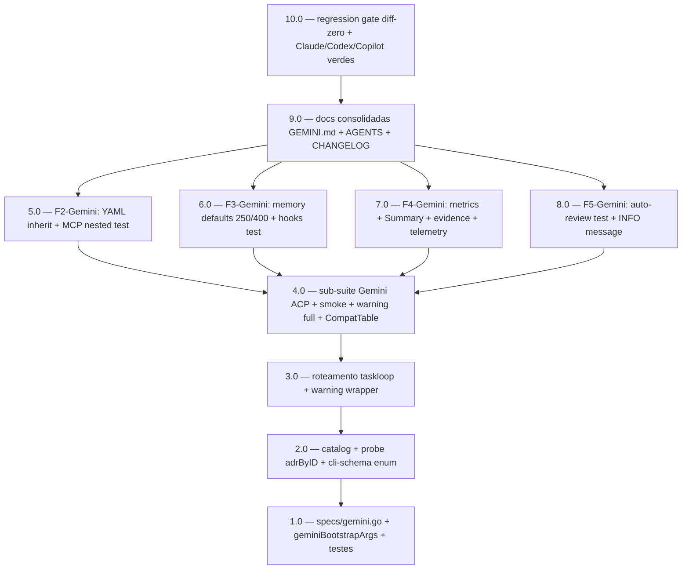

<!-- spec-hash-prd: 1db693d11b6250d420e8052d31f22caa06532c64dcf7332e565b533533ac1bcb -->
<!-- spec-hash-techspec: 307fbbd2fe9c7f76e297625a032450ad471678a0adbc126c67fd6cab7c48e2c9 -->

# Resumo das Tarefas de Implementação para Gemini CLI via ACP Nativo

## Metadados

- **PRD:** `.specs/prd-gemini-cli-acp-2026/prd.md`
- **Especificação Técnica:** `.specs/prd-gemini-cli-acp-2026/techspec.md`
- **ADR material:** `.specs/adr/015-gemini-cli-acp-native.md`
- **Insumo de pesquisa:** `docs/research/compozy-adaptation-gemini-2026.md`
- **Precedentes diretos:** `.specs/prd-codex-acp-spec/` (F1-Codex — `BootstrapArgsFunc` reusada); `.specs/prd-claude-cli-acp-2026/` (F2-F5-Claude — cascata tool-agnóstica)
- **Total de tarefas:** 10
- **Tarefas paralelizáveis:** 5.0 ↔ 6.0 ↔ 7.0 ↔ 8.0 (W2 — após 4.0); demais sequenciais

## Tarefas

<!-- Colunas e formato canônico (MANDATÓRIO):
     - `#`: id decimal `X.Y` (sempre X.0 para tarefas de topo).
     - `Status`: ^(pending|in_progress|needs_input|blocked|failed|done)$
     - `Dependências`: ^(—|\d+\.\d+(,\s*\d+\.\d+)*)$  (em-dash unicode quando vazio)
     - `Paralelizável`: ^(—|Não|Com\s+\d+\.\d+(,\s*\d+\.\d+)*)$
     - `Skills`: skills processuais extras (descoberta agnóstica em `.agents/skills/`). Use `—` quando
       não houver. Nunca listar skills auto-carregadas (governance/linguagem) nem `*-implementation`.
     - `Fase` (OPCIONAL): inteiro positivo para agrupamento visual de fases de entrega. Pode ser
       omitida em PRDs pequenos; `execute-all-tasks` não consome esta coluna. Se incluída, mantenha
       em todas as linhas para não quebrar o parser de tabela markdown. -->

| # | Título | Status | Dependências | Paralelizável | Skills |
|---|--------|--------|--------------|---------------|--------|
| 1.0 | Criar specs/gemini.go + geminiBootstrapArgs + testes unit | done | — | — | — |
| 2.0 | Wiring: catalog + probe adrByID + cli-schema.json enum | done | 1.0 | Não | — |
| 3.0 | Roteamento taskloop + warning wrapper deprecation sync.Once | done | 2.0 | Não | — |
| 4.0 | Sub-suite Gemini integration + smoke + warning access-mode=full + CompatibilityTable | done | 3.0 | Não | — |
| 5.0 | F2-Gemini: YAML inherit:common + MCP nested-agent integration test | done | 4.0 | Com 6.0, 7.0, 8.0 | — |
| 6.0 | F3-Gemini: switch tool-aware memory defaults 250/400 + hooks integration | done | 4.0 | Com 5.0, 7.0, 8.0 | — |
| 7.0 | F4-Gemini: gemini_metrics.go + Summary + convert + evidence + telemetry | done | 4.0 | Com 5.0, 6.0, 8.0 | — |
| 8.0 | F5-Gemini: auto-review integration test + INFO custo amplificado | done | 4.0 | Com 5.0, 6.0, 7.0 | — |
| 9.0 | Documentação consolidada: GEMINI.md + AGENTS.md + CHANGELOG + telemetry-feedback-cycle | done | 5.0, 6.0, 7.0, 8.0 | Não | — |
| 10.0 | Regression gate: diff-zero + suite completa Claude/Codex/Copilot verde | done | 9.0 | Não | — |

## Dependências Críticas

- **1.0 é fundação isolada**: `internal/runtime/specs/gemini.go` reutiliza `BootstrapArgsFunc` e `AccessMode` introduzidos por ADR-013 (F1-Codex). Diff zero em `specs/spec.go`, `specs/claude.go`, `specs/codex.go`, `specs/copilot.go` é gate obrigatório. Validar via `go test ./internal/runtime/specs/...` (100% verde) antes de avançar para 2.0.

- **2.0 é precondição do wiring**: registrar `"gemini"` em `runtimeACPCatalog` (CLI) e `adrByID` (probe). Sem 2.0, gate atual em `task_loop.go` continua rejeitando `--tool gemini --runtime acp`. Inclui também `docs/cli-schema.json` (enum) para CI passar.

- **3.0 é gate de coexistência wrapper ↔ ACP**: roteamento em `taskloop.go::Service.Execute` (case "gemini" via ACPRunner) + warning único via `sync.Once` em `wrapper.go::buildInstruction` quando wrapper legado é invocado. Crítico para preservar UX dos scripts CI existentes (TD-05).

- **4.0 é gate de regressão observacional**: sub-suite Gemini em `acp_integration_test.go` deve cobrir ≥ 90% dos casos do Codex (RF-09). Smoke test real (`tests/integration/gemini_acp_smoke_test.go`) é skipável via `-short` quando `gemini` não está no PATH. Warning único `accessModeFullWarnOnce` reutilizado para Gemini (RF-33). Validação de `CompatibilityTable` (RF-28) garante que modelos Gemini já catalogados continuam aceitos.

- **5.0/6.0/7.0/8.0 têm dependência inter-PRD** com `.specs/prd-claude-cli-acp-2026/` (Q9 do PRD):
  - **5.0 → F2-Claude**: requer `internal/runtime/events/normalize.go` (resolveInherit) e `internal/runtime/mcpserver/` (server + engine).
  - **6.0 → F3-Claude**: requer `internal/runtime/hooks/dispatcher.go` e `internal/runtime/memory/store.go`.
  - **8.0 → F5-Claude**: requer `internal/runtime/runner_autoreview.go`.
  - **7.0 → independente**: F4-Gemini não depende de F4-Claude (métricas Gemini-2026 são distintas das Claude-2026, embora padrão de extração seja paralelo).
  - **Política**: orquestrador (`execute-all-tasks`) deve interpretar `blocked` quando dependência cross-PRD não está `done`. Documentar via prefixo `prd-claude-cli-acp-2026/N.0` quando a estrutura do orquestrador suportar; nesta versão, declarar em prosa na descrição de cada task.

- **9.0 é convergente**: GEMINI.md reescrita só faz sentido com F2-F5 finalizadas (capacidades documentadas refletem estado real). CHANGELOG entries cobrem F0..F5 como pacote único.

- **10.0 é gate final**: regression validation roda `go test ./...`, `golangci-lint run`, e `git diff --stat` em módulos protegidos (RF-32) — falha bloqueia merge do PR. Inclui validação T-30 (regressão: Claude com `--reasoning-effort high` permanece no-op via `BootstrapArgs nil`).

## Riscos de Integração

- **Total = 10 (no default)**: F0..F5-Gemini decompõe naturalmente em 10 tasks porque a maior parte da cascata F2-F5 é reuso de infra Claude (zero código novo em mcpserver/hooks/memory/autoreview); o esforço se concentra em F0/F1 (5 tasks) e F4 (1 task), com F2/F3/F5 sendo predominantemente testes de integração (3 tasks consolidadas).

- **R-A (alto)**: dependência inter-PRD com `prd-claude-cli-acp-2026` pode bloquear 5.0/6.0/8.0 indefinidamente se F2/F3/F5-Claude regredirem ou não forem mergeadas. Mitigação: monitorar status de Claude PRD em `_orchestration_report.md`; declarar `blocked` explicitamente quando dependência ausente. Falback: 7.0 (F4-Gemini) é independente — pode ser entregue isoladamente após 4.0.

- **R-B (médio)**: divergência intencional do Compozy em D-05 (mapeamento `AccessMode → --approval-mode`). Risco de drift quando upstream evoluir. Mitigação: T-29/T-30/T-31 fixam mapeamento explicitamente; comentário em `geminiBootstrapArgs` referencia ADR-015 D-05; revisão em audit/ quando `GeminiNpmVersion` atualizar.

- **R-C (médio)**: schema dos campos métrica Gemini-2026 não confirmado contratualmente (A8 do PRD, TD-02 da techspec). Mitigação: extração defensiva `omitempty` absorve renomeações; smoke test (4.0) e métricas em produção (7.0) revelam nomes reais; ajuste via hot-fix ou audit.

- **R-D (médio)**: defaults Gemini-generosos (250/400 linhas) podem amplificar custo em sessões com cache miss alto. Mitigação: 7.0 entrega `cache_read_tokens` em `execution_report.md` — métrica observável; override via flag preservado.

- **R-E (baixo)**: wrapper legado e ACP coexistindo geram log noise. Mitigação: warning único via `sync.Once` (3.0); mensagem referencia ADR-015 explicitamente.

- **R-F (baixo)**: `thoughts_tokens` Gemini 2.5 pode ser sempre zero (não exposto por default). Mitigação: documentado como caveat conhecido (Q8 do PRD); valor zero é semanticamente válido.

- **Paralelismo 5.0 ↔ 6.0 ↔ 7.0 ↔ 8.0**: arquivos disjuntos —
  - 5.0 toca `.agents/normalization-rules.yaml`, `events/normalization-rules.yaml`, `events/normalize.go`, `tests/integration/gemini_mcp_nested_test.go`
  - 6.0 toca `cmd/ai_spec_harness/task_loop.go` (switch defaults), `tests/integration/gemini_hooks_test.go`, `task_loop_test.go` (T-34/T-35)
  - 7.0 toca `internal/runtime/events/gemini_metrics.go` (novo), `runner.go::Summary`, `events/convert.go`, `evidence/evidence.go`, `telemetry/telemetry.go`
  - 8.0 toca apenas `tests/integration/gemini_autoreview_test.go`
  - **Conflito potencial**: 6.0 e 7.0 ambos editam `task_loop.go` mas em pontos diferentes (switch vs flags) — coordenação via PR pequenos ou rebase. Documentar em PR descriptions.

- **Constantes validadas em 2026-05-22**: `GeminiNpmVersion = "0.43.0"` validado via `npm view @google/gemini-cli version dist-tags` (dist-tag `latest = 0.43.0`). Flag `--acp` confirmada estável via `npx --yes @google/gemini-cli@0.43.0 --acp --help`; alias `--experimental-acp` permanece como deprecated upstream.

- **Wrapper legado preservado por 2 versões minor**: Política idêntica à de F1-Copilot (Q5 ADR-012) e F1-Codex (D-05 ADR-013). Remoção é decisão de versão futura, fora deste PRD.

## Cobertura de Requisitos

| Tarefa | Requisitos cobertos | Casos de teste (techspec) |
|--------|---------------------|---------------------------|
| 1.0 | RF-01, RF-02, RF-03, RF-04, RF-10 | T-13, T-14, T-15, T-16, T-29, T-30, T-31 |
| 2.0 | RF-05, RF-06, RF-25, RF-29 | extensão de `TestProbeReferencesADR`, `TestCLISchemaContainsAllTools`, `TestProbeCacheKey` |
| 3.0 | RF-07, RF-08 | extensão de `TestServiceRoutesToACPRunner`, `TestWrapperEmitsDeprecationWarningOnce` |
| 4.0 | RF-09, RF-11, RF-12, RF-28, RF-33 | sub-suite Gemini ACP integration, smoke test, T-13/T-14/T-15/T-16 estendidos, extensão `TestCompatibilityTableContainsGemini`, extensão `TestAccessModeFullEmitsWarning` |
| 5.0 | RF-13, RF-14, RF-15 | T-32, T-33 |
| 6.0 | RF-16, RF-17 | T-34, T-35, integration test hooks |
| 7.0 | RF-18, RF-19, RF-20, RF-21, RF-31 | T-36, T-37, T-38, extensão `TestSummarySerialization`, extensão `TestTelemetryRecordsRuntimeInit` |
| 8.0 | RF-22 | T-39 |
| 9.0 | RF-23, RF-24, RF-26, RF-27 | — (validação documental) |
| 10.0 | RF-30, RF-32; OB-02, OB-06, OB-07 | regressão completa (`go test ./...`), `git diff --stat` em módulos protegidos |

## Grafo de Dependencias

## Legenda de Status

- `pending`: aguardando execução
- `in_progress`: em execução
- `needs_input`: aguardando informação do usuário
- `blocked`: bloqueado por dependência ou falha externa
- `failed`: falhou após limite de remediação
- `done`: completado e aprovado
