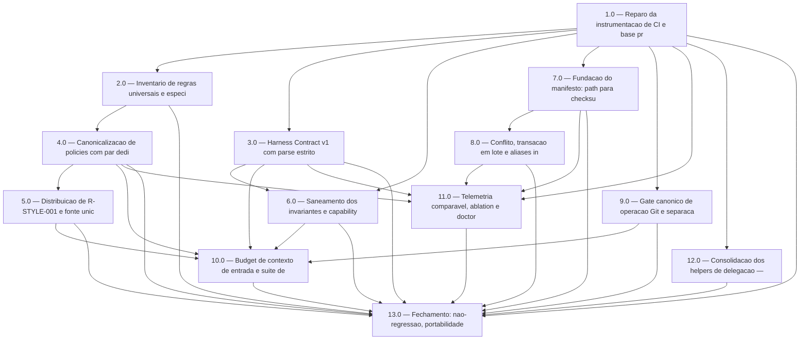

<!-- spec-hash-prd: 0d7928814324ab79c927b439febb697240266a932d7b59b34357f5ebf98ca57e -->
<!-- spec-hash-techspec: 11230c89d66b1540a049283339c1cd980f70df0175055475ad7b05eacced9229 -->
# Resumo das Tarefas de Implementação para Harness Portátil e Vendor-Neutral

## Metadados
- **PRD:** `.specs/prd-harness-portatil-vendor-neutral/prd.md`
- **Especificação Técnica:** `.specs/prd-harness-portatil-vendor-neutral/techspec.md`
- **Total de tarefas:** 13
- **Tarefas paralelizáveis:** 2.0, 3.0, 4.0, 5.0, 6.0, 7.0, 8.0, 9.0, 11.0, 12.0

## Tarefas

| # | Título | Status | Dependências | Paralelizável | Skills |
|---|--------|--------|-------------|---------------|--------|
| 1.0 | Reparo da instrumentacao de CI e base probatoria de filesystem | done | — | Não | — |
| 2.0 | Inventario de regras universais e especificas de fornecedor | done | 1.0 | Com 3.0, 7.0, 9.0 | — |
| 3.0 | Harness Contract v1 com parse estrito | done | 1.0 | Com 2.0, 7.0, 9.0 | — |
| 4.0 | Canonicalizacao de policies com par dedicado de espelhamento | done | 2.0 | Com 3.0, 7.0, 9.0 | — |
| 5.0 | Distribuicao de R-STYLE-001 e fonte unica de lista install/uninstall | done | 4.0 | Com 3.0, 7.0, 9.0 | — |
| 6.0 | Saneamento dos invariantes e capability matrix gerada | done | 1.0, 3.0 | Com 4.0, 7.0, 9.0 | — |
| 7.0 | Fundacao do manifesto: path para checksum e hash fail-closed | done | 1.0 | Com 2.0, 3.0, 4.0, 9.0 | — |
| 8.0 | Conflito, transacao em lote e aliases init e sync | done | 7.0 | Com 6.0, 9.0 | design-patterns-mandatory |
| 9.0 | Gate canonico de operacao Git e separacao da destrutividade | done | 1.0 | Com 2.0, 3.0, 4.0, 5.0, 6.0, 7.0, 8.0 | — |
| 10.0 | Budget de contexto de entrada e suite de conformidade cross-provider | done | 3.0, 4.0, 5.0, 6.0, 9.0 | Não | — |
| 11.0 | Telemetria comparavel, ablation e doctor multi-provider | done | 1.0, 3.0, 4.0, 7.0, 8.0 | Com 10.0 | — |
| 12.0 | Consolidacao dos helpers de delegacao — endurecimento isolado | done | 1.0 | Com 2.0, 3.0, 4.0, 5.0, 6.0, 7.0, 8.0, 9.0 | — |
| 13.0 | Fechamento: nao-regressao, portabilidade, release e documentacao | done | 1.0, 2.0, 3.0, 4.0, 5.0, 6.0, 7.0, 8.0, 9.0, 10.0, 11.0, 12.0 | Não | — |

## Dependências Críticas

- **1.0 precede tudo.** Os gates que deveriam proteger a entrega não executam hoje (V-24, V-33) e o
  duble de filesystem não pode falhar (V-32). Entregar qualquer coisa antes de 1.0 é trabalhar sem rede.
- **7.0 precede 8.0.** Sem `path → checksum` no manifesto, "conflito" não é proposição decidível e
  RF-24 seria falso positivo por construção (V-08).
- **6.0 exige saneamento antes da geração.** RF-18.1 precede RF-18: derivar a matriz de invariante
  auto-satisfeito publicaria tautologia como evidência (V-25, V-26).
- **4.0 precede 5.0.** Só há o que distribuir depois que a origem canônica e o espelho existem.
- **9.0 precede 10.0.** O enforcement de auto-commit não existe hoje (V-23) — não se testa o que não existe.
- **RF-12, RF-13 e RF-61 são indivisíveis** e vivem juntos em 5.0: os quatro pontos hardcoded precisam
  ser tocados no mesmo lote, senão o consumidor recebe metade da governança sem nenhum erro (V-35).
- **O registro anti-gate-órfão é indivisível da entrega de cada gate** (tarefas 4.0, 6.0, 9.0, 10.0):
  alvo no `Makefile`, step em `test.yml` e as duas listas hardcoded do guardião.

## Riscos de Integração

- **Justificativa de exceder o teto de 10 tarefas** (`create-tasks` Etapa 3.2 autoriza com justificativa
  documentada): a techspec sequenciou **17 unidades indivisíveis** por dependência técnica verificada
  (D-a..D-m). Consolidar em 10 exigiria 7 fusões, e a mais cara juntaria num só rollback a criação do
  gate Git, o numerador de contexto por provedor e a suíte cross-provider — três riscos classificados
  como alto. O gate Git é declarado independente dos demais passos e entregável cedo; fundi-lo
  destruiria essa folga de agendamento. O teto foi elevado para 13 em `.agents/config.yaml` — diretório vendor-neutral, na mesma cascata de
  precedência, escolhido por coerência com a RNF01 que este próprio PRD existe para satisfazer.
  **Limite honesto:** essa chave não é lida por nenhum código Go ou shell do repositório — ela existe
  na prosa da skill e serve de declaração auditável para agentes, não de enforcement.
- **12.0 é isolada por exigência da techspec.** Endurecer o gate de delegação pode deixar a árvore
  vermelha antes de ficar verde; ela não pode estar no caminho crítico de outra entrega.
- **Colisão de arquivos entre frentes paralelas:** 5.0 e 8.0 tocam os mesmos arquivos de install e
  upgrade; 5.0 e 6.0 tocam ambos o arquivo de paridade. Coordenar por ordem de merge, não por bloqueio.
- **V-41 é armadilha ativa:** todo pacote de integração novo precisa cair num dos três pacotes que o CI
  roda, ou o workflow é corrigido na mesma tarefa — senão o gate nasce órfão.
- **`mockery.yml` não tem rede de segurança (V-39):** interface nova sem declaração não falha gate
  algum. É item de DoD das tarefas 3.0, 7.0 e 8.0.
- **RF-60 tem alocação fixada:** a execução automática da verificação de integridade pertence a 1.0;
  11.0 apenas consome o resultado no bloco Core. Registrado para não gerar retrabalho.
- **RF-24 é intrinsecamente bipartido:** registrar o checksum (7.0) e usá-lo para decidir conflito
  (8.0). Aparece nas duas tarefas por necessidade, não por duplicação acidental.

## Cobertura de Requisitos

| Tarefa | Requisitos cobertos |
|--------|-------------------|
| 1.0 | RF-20.1, RF-58, RF-59, RF-60, RF-63 |
| 2.0 | RF-01, RF-14, RF-54 |
| 3.0 | RF-02, RF-03, RF-04, RF-05, RF-06, RF-07, RF-08 |
| 4.0 | RF-09, RF-10, RF-11, RF-16 |
| 5.0 | RF-12, RF-13, RF-61 |
| 6.0 | RF-15, RF-17, RF-18, RF-18.1, RF-19, RF-20, RF-21 |
| 7.0 | RF-24 |
| 8.0 | RF-22, RF-23, RF-23.1, RF-24, RF-25, RF-26, RF-27, RF-28, RF-29 |
| 9.0 | RF-40.1, RF-40.2 |
| 10.0 | RF-35, RF-36, RF-37, RF-38, RF-39, RF-40, RF-41, RF-41.1, RF-42 |
| 11.0 | RF-30, RF-31, RF-32, RF-33, RF-34, RF-43, RF-43.1, RF-44, RF-45, RF-46, RF-47 |
| 12.0 | RF-62 |
| 13.0 | RF-48, RF-49, RF-50, RF-51, RF-52, RF-53, RF-55, RF-56, RF-57, RF-63 |

**70 de 70 RFs cobertos.** Validado programaticamente contra a enumeração de `prd.md` e `techspec.md`
(63 IDs base `RF-01`..`RF-63` + 7 sufixados). Nenhum `REQ-nn` existe nos documentos de origem.

## Grafo de Dependencias

## Legenda de Status
- `pending`: aguardando execução
- `in_progress`: em execução
- `needs_input`: aguardando informação do usuário
- `blocked`: bloqueado por dependência ou falha externa
- `failed`: falhou após limite de remediação
- `done`: completado e aprovado
