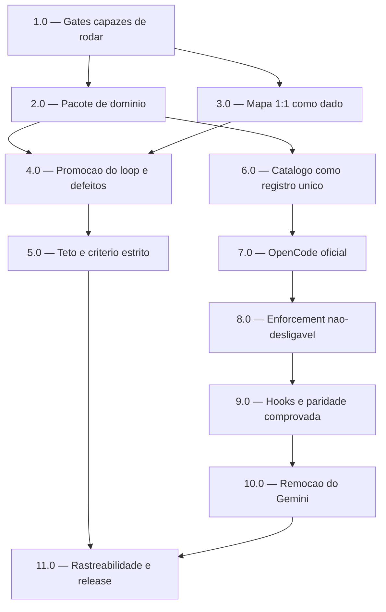

<!-- spec-hash-prd: 0a9ad37a14dece6109b909750abfb8ec3c61f4a66181934758687842764737ce -->
<!-- spec-hash-techspec: a75b561d9d03651ec0453900a8c796027ca114d75268c112ece45fc4f6750862 -->
# Resumo das Tarefas de Implementação para Quatro CLIs Oficiais e Ciclo de Aprovação

## Metadados
- **PRD:** `.specs/prd-harness-quatro-clis-loop-aprovacao/prd.md`
- **Especificação Técnica:** `.specs/prd-harness-quatro-clis-loop-aprovacao/techspec.md`
- **Total de tarefas:** 11
- **Tarefas paralelizáveis:** 2.0 e 3.0

## Tarefas

<!-- Colunas e formato canônico (MANDATÓRIO):
     - `#`: id decimal `X.Y` (sempre X.0 para tarefas de topo).
     - `Status`: ^(pending|in_progress|needs_input|blocked|failed|done)$
     - `Dependências`: ^(—|\d+\.\d+(,\s*\d+\.\d+)*)$  (em-dash unicode quando vazio)
     - `Paralelizável`: ^(—|Não|Com\s+\d+\.\d+(,\s*\d+\.\d+)*)$
     - `Skills`: skills processuais extras (descoberta agnóstica em `.agents/skills/`). Use `—` quando
       não houver. Nunca listar skills auto-carregadas (`category: governance` ou `category: language`).
     - `Fase` (OPCIONAL): inteiro positivo para agrupamento visual de fases de entrega. Pode ser
       omitida em PRDs pequenos; `execute-all-tasks` não consome esta coluna. Se incluída, mantenha
       em todas as linhas para não quebrar o parser de tabela markdown. -->

| # | Título | Status | Dependências | Paralelizável | Skills |
|---|--------|--------|-------------|---------------|--------|
| 1.0 | Tornar os gates capazes de rodar e de dizer a verdade | done | — | — | — |
| 2.0 | Pacote de domínio do Ciclo de Aprovação, sem consumidor | done | 1.0 | Com 3.0 | domain-modeling-production |
| 3.0 | Mapa 1:1 critério-evidência como dado verificável | done | 1.0 | Com 2.0 | — |
| 4.0 | Promoção do loop ao agregado e correção dos defeitos de causa-raiz | pending | 2.0, 3.0 | Não | — |
| 5.0 | Propagação do teto de rodadas e virada do critério estrito | pending | 4.0 | Não | — |
| 6.0 | Catálogo de Agentes como registro único | pending | 2.0 | Não | domain-modeling-production |
| 7.0 | OpenCode como agente oficial de primeira classe | pending | 6.0 | Não | — |
| 8.0 | Enforcement não-desligável do OpenCode | pending | 7.0 | Não | — |
| 9.0 | Hooks e paridade comprovada nos quatro agentes | pending | 8.0 | Não | — |
| 10.0 | Remoção total do Gemini e desinstalação fiel | pending | 9.0 | Não | — |
| 11.0 | Fechamento: rastreabilidade, não-regressão e release major | pending | 5.0, 10.0 | — | github-diff-changelog-publisher |

## Dependências Críticas

- **1.0 é aresta sem predecessora.** O gate de contrato em `cmd/ai_spec_harness/cli_contract_test.go:181-184`
  **exige** a presença da string do agente a ser removido no esquema da linha de comando; enquanto ele
  existir, qualquer edição que remova essa string quebra o build. Além disso, o gate de referências de
  caminho usa um recurso de shell indisponível na versão instalada em macOS, saindo com sucesso sem
  verificar nada — RF-63 é vazio até que isso seja corrigido.
- **3.0 bloqueia 5.0.** O mapa 1:1 não existe como dado hoje: o template de artefato de revisão não tem
  seção para ele e o validador não o cobra. Ligar o critério estrito de aprovação antes disso converte o
  falso positivo atual em **falso negativo total** — todo ciclo terminaria bloqueado.
- **2.0 precede 4.0 e 6.0.** O agregado precede seus dois consumidores.
- **7.0 precede 10.0.** Nas células de ocupante único — a tabela de orçamento de janela grande e a lista
  de herança comum das regras de normalização — o OpenCode precisa assumir a entrada **antes** de o
  Gemini sair. Esvaziá-las muda o comportamento sem que nenhum teste falhe.
- **9.0 precede 10.0.** Os gates de paridade são escritos com as células ainda completas, para que
  fiquem vermelhos exatamente se a remoção degradar a cobertura. Inverter elimina o único sinal.
- **4.0 e 5.0 são sequenciais entre si.** A virada do critério estrito só é segura depois que o veredito
  passa a vir da saída real do revisor.

## Riscos de Integração

**Excesso deliberado do teto default de 10 tarefas: este PRD é decomposto em 11.**

O teto existe para forçar consolidação de PRDs grandes em fatias coerentes. A consolidação foi aplicada
até o limite do que é seguro, e o décimo primeiro item não é fragmentação — é uma dependência dura que
nenhuma outra fatia pode absorver. Três restrições impedem chegar a dez:

1. **Uma fase que a especificação técnica não previa.** As tarefas 1.0 e 2.0 não podem ser fundidas: o
   que a 1.0 conserta é a *própria capacidade de validar* as demais tarefas. Fundi-las significaria criar
   o pacote de domínio sob um gate que não roda.
2. **Uma dependência bloqueante que estava sequenciada tarde demais.** A tarefa 3.0 não cabe em 2.0, que
   é domínio puro sem consumidor, nem em 4.0, que já carrega os dois defeitos de causa-raiz do falso
   positivo. É fatia obrigatória entre as duas.
3. **O raio de explosão da introdução do novo agente.** Fundir 6.0 com 7.0 produziria um commit que altera
   o catálogo **e** seu conteúdo simultaneamente, impedindo bissecção exatamente no ponto onde está a
   armadilha de regressão mais cara: o fallback silencioso que executa o job inteiro no agente errado
   sem erro.

**Alternativa a dez, rejeitada:** fundir 10.0 e 11.0 numa fatia de remoção e release chega ao teto, ao
custo de dissolver a verificação de não-regressão dentro da tarefa de maior raio de explosão da entrega.

**Outros pontos de integração com risco de retrabalho:**

- **O veredito de produção hoje aprova sempre.** A correção em 4.0 muda isso para uma fração
  desconhecida de bloqueios. Sem linha de base gravada antes da mudança, não se distingue "gate
  funcionando" de "gate quebrado".
- **A desinstalação passa a apagar mais arquivos**, guiada por manifesto por arquivo. Manifestos antigos
  no disco não têm o campo e precisam cair em caminho conservador anunciado, sob risco de apagar arquivo
  do usuário.
- **A sanitização de ambiente** precisa preservar ambiente herdado byte-idêntico para os três agentes
  atuais, cuja política é zero-value.
- **Quatro requisitos tocam os quatro agentes de uma vez** — cobertura de pontos canônicos, gate de
  encerramento, gate de build da matriz e sincronia de espelhos — concentrados em 6.0 e 9.0.
- **O hook de encerramento de um dos agentes nunca disparou**, por chave de evento inválida cuja
  asserção de teste protege o comportamento errado. Corrigi-lo é ativar um gate novo, não restaurar um
  existente.

## Cobertura de Requisitos

| Tarefa | Requisitos cobertos |
|--------|-------------------|
| 1.0 | RF-08, RF-63 |
| 2.0 | RF-30, RF-33, RF-37, RF-41, RF-45, RF-46, RF-48, RF-49, RF-50 |
| 3.0 | RF-47, RF-51, RF-52, RF-53, RF-54 |
| 4.0 | RF-31, RF-34, RF-38, RF-39, RF-40, RF-42, RF-44, RF-57, RF-58 |
| 5.0 | RF-32, RF-35, RF-36, RF-56 |
| 6.0 | RF-07, RF-22, RF-26 |
| 7.0 | RF-06, RF-10, RF-11, RF-12, RF-13, RF-14, RF-15, RF-16, RF-17, RF-18 |
| 8.0 | RF-19, RF-20, RF-21, RF-23 |
| 9.0 | RF-24, RF-25, RF-27, RF-28, RF-29, RF-43, RF-59 |
| 10.0 | RF-01, RF-02, RF-03, RF-04, RF-05, RF-09, RF-60 |
| 11.0 | RF-55, RF-61, RF-62 |

## Grafo de Dependencias

## Legenda de Status
- `pending`: aguardando execução
- `in_progress`: em execução
- `needs_input`: aguardando informação do usuário
- `blocked`: bloqueado por dependência ou falha externa
- `failed`: falhou após limite de remediação
- `done`: completado e aprovado
