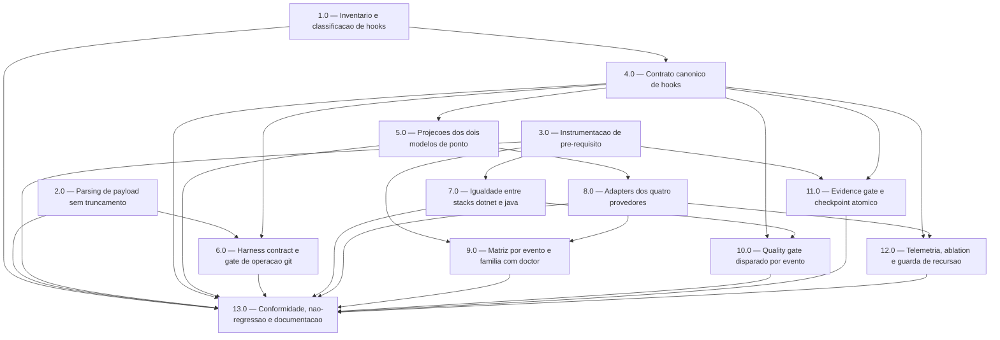

<!-- spec-hash-prd: d82183d24c937cef552bf9404a0b14a2a8a8d0fd1308f300b1b46dc52d43d076 -->
<!-- spec-hash-techspec: 28182779dacbe9ecab5f7575266e291df6caea8b42a21bd34f70199ec162104c -->
# Resumo das Tarefas de Implementação para Hooks Canônicos, Determinísticos e Vendor-Neutral

## Metadados
- **PRD:** `.specs/prd-hooks-canonicos-vendor-neutral/prd.md`
- **Especificação Técnica:** `.specs/prd-hooks-canonicos-vendor-neutral/techspec.md`
- **Total de tarefas:** 13
- **Tarefas paralelizáveis:** 1.0, 2.0, 3.0, 5.0, 6.0, 7.0, 8.0, 9.0, 10.0, 11.0, 12.0

## Tarefas

<!-- Colunas e formato canônico (MANDATÓRIO):
     - `#`: id decimal `X.Y` (sempre X.0 para tarefas de topo).
     - `Status`: ^(pending|in_progress|needs_input|blocked|failed|done)$
     - `Dependências`: ^(—|\d+\.\d+(,\s*\d+\.\d+)*)$  (em-dash unicode quando vazio)
     - `Paralelizável`: ^(—|Não|Com\s+\d+\.\d+(,\s*\d+\.\d+)*)$
     - `Skills`: skills processuais extras (descoberta agnóstica em `.agents/skills/`). Use `—` quando
       não houver. Nunca listar skills auto-carregadas (`category: governance` ou `category: language`).
     - `Fase` (OPCIONAL): inteiro positivo para agrupamento visual de fases de entrega. Pode ser
       omitida em PRDs pequenos; `execute-all-tasks` não consome esta coluna. Se incluída, mantenha
       em todas as linhas para não quebrar o parser de tabela markdown. -->

| # | Título | Status | Dependências | Paralelizável | Skills |
|---|--------|--------|-------------|---------------|--------|
| 1.0 | Inventario e classificacao de hooks com gate anti-orfao | done | — | Com 2.0, 3.0 | — |
| 2.0 | Parsing de payload sem truncamento e negacao por ausencia de alvo | done | — | Com 1.0, 3.0 | — |
| 3.0 | Instrumentacao de pre-requisito: tmp em gates, exaustividade de linguagens e prova por celula | done | — | Com 1.0, 2.0 | — |
| 4.0 | Contrato canonico de hooks em internal/hookcontract | done | 1.0 | Não | — |
| 5.0 | Projecoes dos dois modelos de ponto, correcao de Kind e erros nao descartados | done | 4.0 | Com 7.0 | — |
| 6.0 | Harness contract aplicado e gate de operacao git derivado da policy | done | 2.0, 4.0 | Com 7.0 | — |
| 7.0 | Igualdade entre stacks: dotnet completo e java como cidadao de primeira classe | done | 3.0 | Com 5.0, 6.0 | — |
| 8.0 | Adapters dos quatro provedores com SessionStart e SessionEnd reais | pending | 5.0 | Com 10.0 | — |
| 9.0 | Matriz de capabilities por evento e familia com doctor de hooks | pending | 3.0, 8.0 | Com 12.0 | — |
| 10.0 | Quality gate disparado por evento com selecao por risco e deduplicacao | done | 4.0, 7.0 | Com 8.0, 11.0 | — |
| 11.0 | Evidence gate, checkpoint atomico, deteccao de corrupcao e sanitizacao | pending | 3.0, 4.0 | Com 10.0 | — |
| 12.0 | Telemetria comum, ablation, timeout e guarda de recursao | pending | 4.0, 8.0 | Com 9.0 | — |
| 13.0 | Conformidade cross-provider, nao-regressao e documentacao | pending | 1.0, 2.0, 3.0, 4.0, 5.0, 6.0, 7.0, 8.0, 9.0, 10.0, 11.0, 12.0 | Não | — |

## Dependências Críticas

- **Pré-condição externa bloqueante, anterior à tarefa 1.0.** O PRD dependente
  `.specs/prd-harness-portatil-vendor-neutral/` está marcado 13/13 `done`, mas **nada está no
  histórico do git**: `HEAD` é `a8b7721` (release v2.0.1, anterior ao PRD) e `git status --short`
  retorna 119 entradas com zero commits. Estão untracked os pacotes sobre os quais este PRD
  constrói — `internal/capability/`, `internal/txn/`, `internal/harness/`, `internal/conformance/`,
  `internal/batchreport/`, `internal/telemetry/ablation.go`,
  `tests/integration/conformance_suite_test.go`, `.agents/policies/` — e `Makefile` e
  `.github/workflows/test.yml`, que carregam os gates novos, estão modificados e não staged.
  Qualquer `git clean`, `git stash` ou troca de branch destrói a base. **Nenhuma tarefa começa antes
  do commit dessa base.**

- **1.0 precede 4.0.** A User Story declara o inventário como gate: nenhum hook novo antes dele
  ("Nenhum novo hook deve ser criado antes do inventário", Fase 1). O contrato canônico introduz o
  vocabulário sobre o qual os hooks passam a existir, portanto não antecede o levantamento.

- **2.0 é independente e deve ir primeiro na prática.** Fecha um bypass verificado end-to-end: um
  payload de 70.077 bytes com `; git push origin main` ao fim produz **exit 0**, contra **exit 2** do
  controle. A causa é `head -c 65536` em `.agents/lib/parse-hook-input.sh:10,53` combinado com
  `exit 0` para comando vazio em `.agents/scripts/git-operation-gate.sh:39-40`. Não depende de
  nenhuma outra tarefa e não deve esperar por nenhuma.

- **3.0 precede 7.0 e 11.0, e é pré-requisito de 9.0.** Reúne os três gates que precisam nascer
  vermelhos antes do trabalho que eles protegem:
  1. isentar `.tmp-*` em `internal/taskloop/orchestrator.go:456-512` e `isolation.go:322` — hoje o
     padrão **não consta** em nenhum dos dois, e migrar escrita atômica sob `.specs/` antes disso faz
     o temporário entrar no patch semântico, alterar o `PatchSHA256` e disparar o fail-closed de
     `orchestrator.go:352-354`;
  2. `TestAllLangsAreExhaustivelyWired`, que nasce vermelho para `LangDotNet` antes de Java existir;
  3. indexação da prova de dispatch por célula em `internal/capability/evidence.go:146-149`.

- **4.0 precede 5.0, 6.0, 10.0, 11.0 e 12.0.** Todas consomem `Decision`, `Result` ou o `Envelope`
  versionado. 4.0 é puramente aditiva: nada a consome enquanto ela é escrita.

- **5.0 precede 8.0.** Os adapters só podem declarar `SessionStart` e o `SessionEnd` real depois que
  `NewEnforcement` deixar de exigir exatamente três pontos (`enforcement.go:137-141`, construtor em `:123`) — hoje ampliar
  causa `panic` no init do catálogo em `registry.go:296,307`.

- **8.0 precede 9.0 e 12.0.** A matriz por evento e família e a telemetria por provedor dependem dos
  pares `(provedor, evento)` declarados.

- **13.0 depende de todas.** É o fechamento de não-regressão; não pode ser antecipada nem fundida.

## Riscos de Integração

### Justificativa de usar as 13 tarefas do teto

`.agents/config.yaml` declara `max_tasks_per_prd: 13` e a skill `create-tasks` Etapa 3.2 autoriza
exceder o default de 10 com justificativa documentada. O PRD tem **75 requisitos funcionais**.
Consolidar abaixo de 13 exigiria fundir frentes com perfis de risco incompatíveis: a mais cara
juntaria num mesmo rollback a correção de segurança do parsing (2.0), a criação do contrato (4.0) e a
migração de escrita atômica (11.0) — três riscos distintos, sendo que 2.0 precisa poder entrar
sozinha e imediatamente. A 3.0 agrupa três itens heterogêneos **por uma propriedade comum real**:
cada um é um gate que precisa falhar antes do trabalho que protege; separá-los estouraria o teto sem
ganho de segurança.

### Não-regressão — gates obrigatórios por área tocada

Requisito inegociável deste PRD. Toda tarefa declara, nos seus critérios de aceitação, os gates da
tabela de `AGENTS.md` correspondentes à área que toca. O mínimo transversal é `make test lint vet`.

| Área tocada pela tarefa | Gate obrigatório | Tarefas |
|---|---|---|
| `.agents/skills/`, `.agents/lib/`, `.agents/hooks/` | `make check-skills-sync check-hooks-sync` | 1.0, 2.0, 6.0, 7.0 |
| `.agents/scripts/` | `make check-scripts-sync test-validators` | 2.0, 6.0, 7.0, 11.0 |
| `.agents/policies/` | `make check-policies-sync` | 6.0 |
| `.claude/hooks/`, `.agents/hooks/` | `make test-hooks` | 1.0, 2.0, 6.0 |
| `internal/capability/` | `make check-capability-matrix-sync` | 3.0, 9.0 |
| Mocks (`mockery.yml`) | `make check-mocks` | 4.0, 6.0, 11.0 |
| Cobertura | `make coverage` (75% total, 70% por pacote crítico) | todas |

### Armadilhas verificadas que produzem regressão silenciosa

- **Ordem em `manifestTypes`** (`internal/detect/toolchain.go:99-108`): o desempate é "primeiro
  candidato com score máximo vence" (`:139-145`). Marcadores de Java e .NET **só podem ser
  apendados ao fim**; inserir no meio muda o vencedor em monorepo poliglota e quebra o cenário
  `polyglot-monorepo` de `tests/integration/portability_test.go`, cujo `wantStackSub` é substring
  **contígua**. Vale igualmente para `"C#/.NET"` e `"Java/Kotlin"` em `DetectPrimaryStack`
  (`internal/detect/framework.go:125-166`).
- **Testes de falso verde** (`internal/install/verify_lang_filter_test.go`): listam `AllLangs`
  manualmente expandido. Ao acrescentar `LangJava` continuam compilando e passando **sem cobrir
  Java** — pior que quebrar. Precisam passar a usar `skills.AllLangs` na mesma tarefa.
- **Aritmética hardcoded** em `internal/skills/skills_test.go` (`len(BaseSkills) + len(ComplementarySkills) + 2`)
  quebra ao mexer em `LangSkills`.
- **Teste que codifica o bug**: `internal/triggers/triggers_test.go:133` assere que `"java"` e
  `"kotlin"` caem no fallback para Go. É o único teste que quebra de propósito; precisa ser editado
  no mesmo commit da correção.
- **Ampliar regex de evidência afrouxa o gate** — risco inverso do usual. `validate-task-evidence.sh:180`
  não tem **nenhum** teste automatizado hoje; os casos entram em `scripts/test-validators.sh`
  **antes** da ampliação. E `TEST_NAME_RE` (`validate-review-evidence.sh:46`) é Go-only; ampliá-la
  globalmente afrouxaria o gate para todas as linguagens, Go inclusive — deve ficar condicionada à
  stack detectada.
- **`WriteFileAtomic` cria inode novo**: perde dono, grupo, ACL e xattr, **quebra hard link** e
  **destrói symlink de destino** por rename. `internal/install/install.go` espelha hooks entre cinco
  diretórios — a tarefa 11.0 não toca caminhos de instalação, e a verificação de hard link e symlink
  precede cada migração.
- **Deixar de descartar o erro em `internal/runtime/runner.go:428,466` passa a bloquear** onde hoje
  não bloqueia. Hoje nenhum hook de produção está registrado nesses dois pontos, então a mudança é
  inerte — por isso entra na 5.0, **antes** de a 10.0 registrar o primeiro hook ali, e não depois.
- **Relaxar `NewEnforcement`** derruba praticamente toda a suíte por `panic` no init do catálogo. Os
  dez pontos afetados são conhecidos e entram no mesmo lote da 5.0: `registry_test.go:131,141`,
  `hooks_parity_matrix_test.go:95,101`, `parity_dispatch_proof_test.go:280`,
  `precondition_report_test.go:35,66`, `precondition_test.go:333`, `hooks_live/matrix.go:20`,
  `live_test.go:147,393`.
- **Gate órfão**: todo pacote de integração novo precisa cair num dos jobs que o CI executa, ou o
  workflow é corrigido na mesma tarefa. Armadilha ativa herdada do PRD dependente.
- **Duas tarefas do PRD dependente estão `done` sem entregar o que prometem**: a 10.0 cobre 5 dos 14
  cenários de conformidade, e a 3.0 não produziu `.agents/harness.yaml` — que **não existe em lugar
  nenhum do repositório** — deixando `GitPolicy.AutoCommit`/`AutoPush` com zero call-sites de
  produção. Este PRD não pode presumir nenhum dos dois: a 6.0 cria o artefato e o elo, a 13.0 cobre
  os nove cenários faltantes.

## Cobertura de Requisitos

| Tarefa | Requisitos cobertos |
|--------|-------------------|
| 1.0 | RF-01, RF-02, RF-03, RF-04, RF-05, RF-70 |
| 2.0 | RF-57, RF-68 |
| 3.0 | RF-59 |
| 4.0 | RF-06, RF-07, RF-09, RF-10, RF-12, RF-13, RF-14, RF-15, RF-16, RF-17 |
| 5.0 | RF-08, RF-11 |
| 6.0 | RF-18, RF-19, RF-20, RF-21, RF-22, RF-23, RF-24 |
| 7.0 | RF-31, RF-32, RF-33, RF-34, RF-73 |
| 8.0 | RF-51, RF-52, RF-53, RF-54, RF-55, RF-56, RF-58, RF-69, RF-71, RF-72 |
| 9.0 | RF-59, RF-60 |
| 10.0 | RF-25, RF-26, RF-27, RF-28, RF-29, RF-30 |
| 11.0 | RF-35, RF-36, RF-37, RF-38, RF-39, RF-40, RF-41, RF-42, RF-43, RF-44, RF-49 |
| 12.0 | RF-45, RF-46, RF-47, RF-48, RF-50, RF-64, RF-65, RF-66, RF-67 |
| 13.0 | RF-61, RF-62, RF-63, RF-74, RF-75 |

**75 de 75 RFs cobertos.** Enumeração contígua `RF-01`..`RF-75` validada contra `prd.md`. Nenhum
`REQ-nn` existe nos documentos de origem. `RF-59` aparece em 3.0 e 9.0 por necessidade — a indexação
da prova precede a matriz que a consome —, não por duplicação acidental.

## Grafo de Dependencias

## Legenda de Status
- `pending`: aguardando execução
- `in_progress`: em execução
- `needs_input`: aguardando informação do usuário
- `blocked`: bloqueado por dependência ou falha externa
- `failed`: falhou após limite de remediação
- `done`: completado e aprovado
