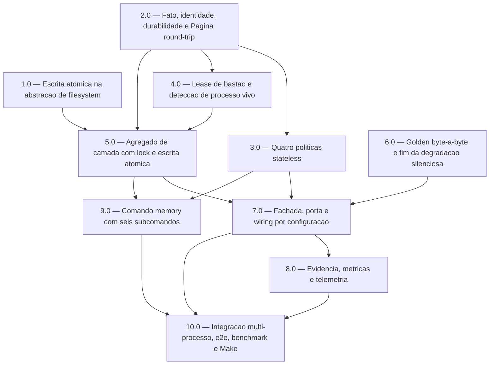

<!-- spec-hash-prd: 223b55df6ca415d48c7af39dcc748d59746d9543cd76739ea21ad31d1dc59a27 -->
<!-- spec-hash-techspec: 33d48c5881a256b0e47b76f62befff9bacbad1f81721125a450312f83929c560 -->
# Resumo das Tarefas de Implementação para Memória Durável de Agentes

## Metadados
- **PRD:** `.specs/prd-memoria-duravel-agentes/prd.md`
- **Especificação Técnica:** `.specs/prd-memoria-duravel-agentes/techspec.md`
- **Total de tarefas:** 10
- **Tarefas paralelizáveis:** 1.0 com 6.0 · 3.0 com 4.0 · 8.0 com 9.0

## Tarefas

<!-- Colunas e formato canônico (MANDATÓRIO):
     - `#`: id decimal `X.Y` (sempre X.0 para tarefas de topo).
     - `Status`: ^(pending|in_progress|needs_input|blocked|failed|done)$
     - `Dependências`: ^(—|\d+\.\d+(,\s*\d+\.\d+)*)$  (em-dash unicode quando vazio)
     - `Paralelizável`: ^(—|Não|Com\s+\d+\.\d+(,\s*\d+\.\d+)*)$
     - `Skills`: skills processuais extras (descoberta agnóstica em `.agents/skills/`). Use `—` quando
       não houver. Nunca listar skills auto-carregadas (`category: governance` ou `category: language`).
     - `Fase` (OPCIONAL): inteiro positivo para agrupamento visual de fases de entrega. Pode ser
       omitida em PRDs pequenos; `execute-all-tasks` não consome esta coluna. Se incluída, mantenha
       em todas as linhas para não quebrar o parser de tabela markdown. -->

| # | Título | Status | Dependências | Paralelizável | Skills |
|---|--------|--------|-------------|---------------|--------|
| 1.0 | Escrita atômica na abstração de filesystem | pending | — | Com 6.0 | — |
| 2.0 | Fato, identidade, durabilidade, sentinelas e Página com round-trip lossless | pending | — | Não | — |
| 3.0 | Quatro políticas stateless: relevância, orçamento, sanitização e compactação | pending | 2.0 | Com 4.0 | — |
| 4.0 | Lease de bastão de continuidade e detecção de processo vivo | pending | 2.0 | Com 3.0 | — |
| 5.0 | Agregado de camada com lock por camada, consolidação e escrita atômica | pending | 1.0, 2.0, 4.0 | Não | — |
| 6.0 | Trava de regressão: golden byte-a-byte e fim da degradação silenciosa | pending | — | Com 1.0 | — |
| 7.0 | Fachada, porta de memória e wiring por configuração | pending | 3.0, 5.0, 6.0 | Não | design-patterns-mandatory |
| 8.0 | Evidência de memória, métricas e telemetria | pending | 7.0 | Com 9.0 | — |
| 9.0 | Comando `memory` com seis subcomandos, incluindo migração | pending | 3.0, 5.0 | Com 8.0 | — |
| 10.0 | Integração multi-processo, e2e, benchmark e alvos de Make | pending | 7.0, 8.0, 9.0 | Não | — |

## Dependências Críticas

- **2.0 é fusão obrigatória, não conveniência.** A assinatura de `Pagina` declarada na techspec usa `Fato` e `BlocoHumano`. Separar tipos de Página produziria uma fatia que não compila sozinha.
- **4.0 precede 5.0 e 7.0.** A MD-003 decide que o lock de camada, e não apenas o bastão, carrega prazo e referência de processo. Sem o lease, o lock de camada herdaria o lock órfão permanente documentado em `internal/taskloop/orchestrator_lock_windows.go:11`, e a precedência de invariantes da fachada nasceria com o passo "dono único de bastão" vazio.
- **6.0 precede 7.0 e não pode ser paralela a ela.** As duas alteram `internal/runtime/runner.go`, e 6.0 instala o gate que protege 7.0. O golden criado em 6.0 é um retrato; ele só se torna gate quando 7.0 passa sem alteração de expectativa.
- **7.0 é o único ponto de risco alto de regressão de prompt.** Concentra alteração simultânea em `internal/runtime/runner.go`, `internal/runtime/types.go`, `internal/config/resolver.go`, `internal/taskloop/{taskloop,acpinvoker,runtimeconfig}.go`, `cmd/ai_spec_harness/task_loop.go`, `docs/cli-schema.json` e `mockery.yml`.
- **10.0 depende de tudo** e é dona única do `Makefile`.
- **1.0 e 2.0 não têm dependência entre si.** A interface `Pagina` opera sobre `[]byte` nas duas direções e não toca filesystem; quem precisa de escrita atômica é 5.0. A dependência afirmada em uma versão anterior da techspec era falsa.

## Riscos de Integração

- **Cascata de configuração tem dois pontos de esquecimento, não um.** Além de `mergeInto` em `internal/config/resolver.go:166`, existe `optionsToConfigOverrides` em `internal/taskloop/runtimeconfig.go`, que hoje propaga apenas `Timeout`, `Concurrent` e `BatchSize`. Esquecer o segundo produz falha assimétrica: a chave de config funciona e a flag de CLI não. Tratado em 4.0 e 7.0, com teste ponta a ponta da flag até o `Job`.
- **Reordenação de `Run()` não é aditiva.** `persistSummary` executa em `internal/runtime/runner.go:209`, antes de `dispatchSessionPostEnd` em `:213`. RF-34 e RF-30 exigem que o despacho anteceda o enriquecimento do relatório. A reordenação é decidida em 7.0, não em 8.0, para não reabrir o arquivo que 7.0 acabou de estabilizar. O defeito já é latente: `summary.ReviewStatus` é atribuído em `:219`, depois de `persistSummary`.
- **Alvos do `Makefile` enumeram diretórios fixos.** `integration` em `Makefile:26` e `bench` em `Makefile:61` não incluem o pacote novo. Sem estendê-los, os testes de integração e o benchmark nunca executam, e o risco migra em silêncio para as outras fatias. 10.0 é dona única.
- **Regeneração de mocks é serial.** `make mocks` reescreve o conjunto inteiro e `make check-mocks` compara tudo. 1.0, 2.0, 5.0 e 7.0 regeneram; duas delas não podem regenerar em paralelo, mesmo quando as dependências permitiriam.
- **Gate bidirecional de contrato de CLI.** `cmd/ai_spec_harness/cli_contract_test.go:81` e `:189` comparam a árvore real de comandos e flags contra `docs/cli-schema.json` nas duas direções. 7.0 (flag) e 9.0 (comando) tocam o mesmo arquivo e por isso não são paralelas.
- **Gates de evidência por expressão regular.** 8.0 injeta seção nova no relatório. Seção mal posicionada fecha prematuramente a captura de uma seção anterior nos validadores de `.agents/scripts/`, desligando o gate em silêncio. Nenhuma expressão nova pode usar classe de bracket com caractere multibyte — em processador de texto orientado a byte ela nunca casa.
- **Código por build tag.** 4.0 entrega detecção de processo vivo em arquivos separados por plataforma. O compilador só prova a plataforma compilada; a CI cobre duas.
- **Teto de tarefas respeitado.** O plano tem exatamente 10 fatias, dentro do default de `AI_MAX_TASKS_PER_PRD`. As 12 entregas da techspec foram consolidadas em 10 por quatro fusões justificadas na seção "Ordem de Build" da techspec; nenhuma fusão mistura preocupações não relacionadas.

## Cobertura de Requisitos

| Tarefa | Requisitos cobertos |
|--------|-------------------|
| 1.0 | RF-16 |
| 2.0 | RF-01, RF-02, RF-05, RF-06, RF-07, RF-12, RF-27, RF-36, RF-37 |
| 3.0 | RF-13, RF-15, RF-17, RF-18 |
| 4.0 | RF-23 |
| 5.0 | RF-01, RF-02, RF-03, RF-04, RF-11, RF-14, RF-16, RF-19, RF-22, RF-26 |
| 6.0 | RF-29, RF-30 |
| 7.0 | RF-08, RF-09, RF-10, RF-13, RF-18, RF-20, RF-21, RF-24, RF-25, RF-28 |
| 8.0 | RF-32, RF-34, RF-35 |
| 9.0 | RF-19, RF-31, RF-32, RF-33 |
| 10.0 | RF-10, RF-16, RF-20, RF-25 |

## Grafo de Dependencias

## Legenda de Status
- `pending`: aguardando execução
- `in_progress`: em execução
- `needs_input`: aguardando informação do usuário
- `blocked`: bloqueado por dependência ou falha externa
- `failed`: falhou após limite de remediação
- `done`: completado e aprovado
