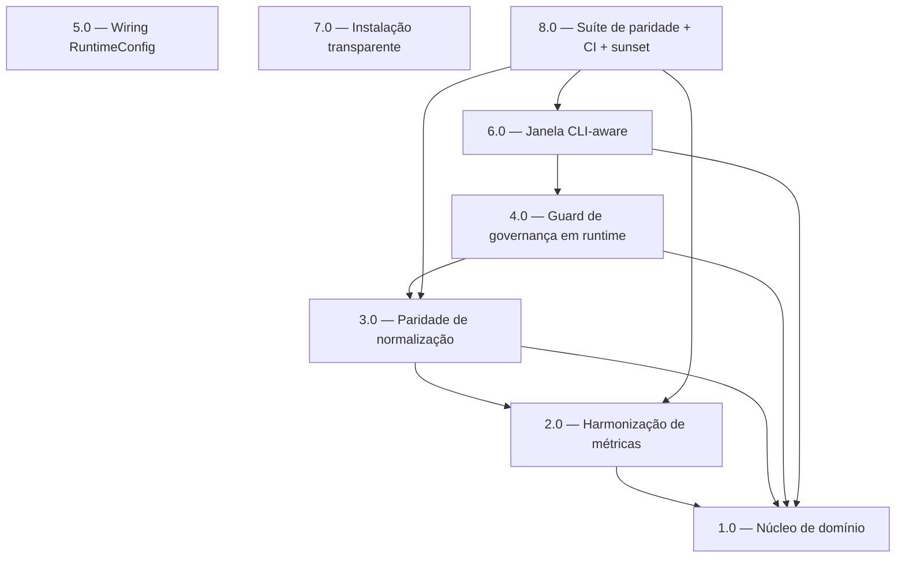

<!-- spec-hash-prd: aee1848a10c8c3b9bbd74803cfed8f4e685c195b52c902acd031f45e23cb0b76 -->
<!-- spec-hash-techspec: b3f563d8dbbad801bf68bbcb2b5293a1787bf2c32ddecfa0a6f6c59363ea3c94 -->

# Resumo das Tarefas de Implementação para Paridade Absoluta Cross-CLI e Instalação Universal Transparente

## Metadados
- **PRD:** `.specs/prd-paridade-cross-cli/prd.md`
- **Especificação Técnica:** `.specs/prd-paridade-cross-cli/techspec.md`
- **Total de tarefas:** 8
- **Tarefas paralelizáveis:** 5.0 e 7.0 (entre si)

## Tarefas

<!-- Colunas e formato canônico (MANDATÓRIO):
     - `#`: id decimal `X.Y` (sempre X.0 para tarefas de topo).
     - `Status`: ^(pending|in_progress|needs_input|blocked|failed|done)$
     - `Dependências`: ^(—|\d+\.\d+(,\s*\d+\.\d+)*)$  (em-dash unicode quando vazio)
     - `Paralelizável`: ^(—|Não|Com\s+\d+\.\d+(,\s*\d+\.\d+)*)$
     - `Skills`: skills processuais extras (descoberta agnóstica em `.agents/skills/`). Use `—` quando
       não houver. Nunca listar skills auto-carregadas (governance/linguagem) nem `*-implementation`.
     - `Fase` (OPCIONAL): inteiro positivo para agrupamento visual de fases de entrega. Pode ser
       omitida em PRDs pequenos; `execute-all-tasks` não consome esta coluna. Se incluída, mantenha
       em todas as linhas para não quebrar o parser de tabela markdown. -->

| # | Título | Status | Dependências | Paralelizável | Skills |
|---|--------|--------|-------------|---------------|--------|
| 1.0 | Núcleo de domínio (Value Objects sem IO) | done | — | — | — |
| 2.0 | Harmonização de métricas (extractor por driver + render unificado) | done | 1.0 | Não | — |
| 3.0 | Paridade de normalização de tool-calls (4 CLIs) | done | 1.0, 2.0 | Não | — |
| 4.0 | Guard de governança em runtime (spec-hash/drift + PRD-first) | done | 1.0, 3.0 | Não | — |
| 5.0 | Wiring do config hierárquico no RuntimeConfig | done | — | Com 7.0 | — |
| 6.0 | Política de janela CLI-aware (token-budget + memória) | done | 1.0, 4.0 | Não | — |
| 7.0 | Instalação universal transparente (stack-aware + probe + verify) | done | — | Com 5.0 | — |
| 8.0 | Suíte de paridade RP-03 + gate CI (RG-03) + plano de sunset legacy | done | 2.0, 3.0, 6.0 | Não | — |

## Dependências Críticas
- **1.0 é fundação:** os Value Objects (`DriverID`, `MetricSet`, `ContextWindow`/`WindowClass`) habilitam 2.0, 3.0, 4.0 e 6.0.
- **Cadeia do runner:** 2.0 → 3.0 → 4.0 → 6.0 editam todas o `internal/runtime/runner.go` — execução sequencial obrigatória (ver Riscos de Integração).
- **8.0 é validação final:** depende da paridade de normalização (3.0), das métricas (2.0) e da janela (6.0) estarem prontas.
- **5.0 e 7.0 são independentes** do hotspot do runner e do núcleo de domínio — podem rodar em paralelo entre si e durante a cadeia 1.0→6.0.

## Riscos de Integração
- **Hotspot `runner.go`:** 2.0, 3.0, 4.0 e 6.0 tocam o mesmo arquivo (`runEventLoop`, `normalizeEventInline`, `prepareHooksDispatcher`, `prepareMemoryStore`). Paralelizá-las esconderia risco de conflito — por isso marcadas `Não`. Manter a ordem 2.0→3.0→4.0→6.0.
- **Refactor de `Summary` (2.0):** remove campos planos consumidos por `persistence`/`evidence`; risco de regressão em relatórios — mitigado por golden tests por driver e header Claude compatível.
- **`SpecDriftHook` falso-positivo (4.0):** uso ad-hoc sem PRD — mitigado por no-op quando `Job.TasksDir==""` e `SkipDriftGuard`.
- **Probe lento sem rede (7.0):** risco ao orçamento de 30s (RF-11) — mitigado por timeout curto e degradação para warning.
- **Mapeamento de tipos config↔runtime (5.0):** drift entre `config.Runtime` e `runtime.RuntimeConfig` — centralizado em `BuildRuntimeConfig` + `ApplyDefaults`.

## Cobertura de Requisitos

| Tarefa | Requisitos cobertos |
|--------|-------------------|
| 1.0 | Base de RP-02, RP-04, RIN-03, RIN-04 (Value Objects) |
| 2.0 | RP-02, RIN-03, RG-04 |
| 3.0 | RP-01, RP-04, RIN-02 |
| 4.0 | RG-01, RG-02 |
| 5.0 | RIN-01 |
| 6.0 | RIN-04 |
| 7.0 | RI-01, RI-02, RI-03, RI-04 |
| 8.0 | RP-03, RG-03, RG-04, RIN-05 |

## Grafo de Dependencias

## Legenda de Status
- `pending`: aguardando execução
- `in_progress`: em execução
- `needs_input`: aguardando informação do usuário
- `blocked`: bloqueado por dependência ou falha externa
- `failed`: falhou após limite de remediação
- `done`: completado e aprovado
