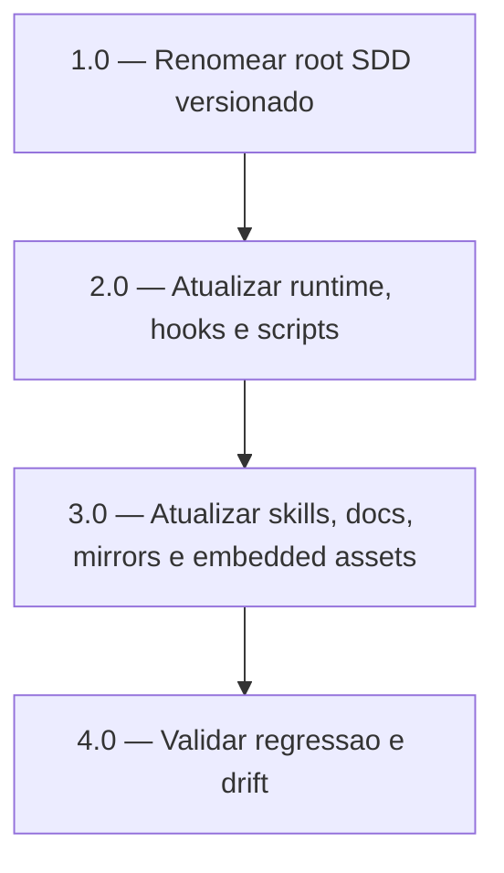

<!-- spec-hash-prd: 20e25ee71b27509adf5cf91f9c5669999bb60da2d162fbee0d5ccc2592f1f835 -->
<!-- spec-hash-techspec: cb0367c46bed5f6d9b6d20e27119b86759613559ca3a30eee1fe6c1ec687d8fb -->

# Tasks: Migracao Mandatoria do Root SDD para `.specs`

## Tarefas

| ID | Titulo | Status | Dependencias | Paralelizavel | Skills |
|---|---|---|---|---|---|
| 1.0 | Renomear root SDD versionado | done | — | Não | go-implementation |
| 2.0 | Atualizar runtime, hooks e scripts | done | 1.0 | Não | go-implementation |
| 3.0 | Atualizar skills, docs, mirrors e embedded assets | done | 2.0 | Não | go-implementation |
| 4.0 | Validar regressao e drift | done | 3.0 | Não | go-implementation |

## Cobertura de Requisitos

| Tarefa | Requisitos cobertos |
|---|---|
| 1.0 | RF-01 |
| 2.0 | RF-02, RF-03, RF-07 |
| 3.0 | RF-04, RF-05, RF-06 |
| 4.0 | RF-01, RF-02, RF-03, RF-04, RF-05, RF-06, RF-07 |

## Grafo

