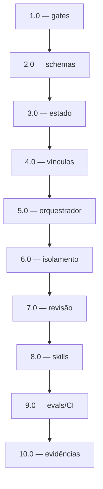

<!-- spec-hash-prd: 6bf36a9566ac7ab0bf400012d56195e750aec0c2e916b1b761cac3b12d00f484 -->
<!-- spec-hash-techspec: 7d707fd9397cac643bdbc54764f7386160130d7f44b405af81527cb847840eb3 -->
# Tarefas — SDD robusto e verificável

| # | Título | Status | Dependências | Paralelizável | Skills |
|---|---|---|---|---|---|
| 1.0 | Fechar escapes críticos de validadores e hooks | done | — | — | — |
| 2.0 | Definir schemas de resultado e adaptar hooks | done | 1.0 | Não | — |
| 3.0 | Implementar estado SDD e comandos de ciclo de vida | done | 2.0 | Não | — |
| 4.0 | Substituir drift textual por vínculos estruturais e validar DAG | done | 3.0 | Não | — |
| 5.0 | Implementar orquestrador idempotente e eventos | done | 4.0 | Não | — |
| 6.0 | Implementar isolamento, capacidades e digest cumulativo | done | 5.0 | Não | — |
| 7.0 | Implementar revisão e bugfix independentes | done | 6.0 | Não | bugfix |
| 8.0 | Simplificar skills, templates e adaptadores portáveis | done | 7.0 | Não | refactor |
| 9.0 | Criar corpus de evals e matriz CI cross-platform | done | 8.0 | Não | — |
| 10.0 | Validar, revisar e registrar evidências finais | done | 9.0 | Não | review |

## Cobertura de Requisitos

| Tarefa | Requisitos cobertos |
|---|---|
| 1.0 | RF-01, RF-03, RF-04, RF-05 |
| 2.0 | RF-02, RF-03, RF-05 |
| 3.0 | RF-06, RF-07, RF-08, NFR-01, NFR-02, NFR-05 |
| 4.0 | RF-09, RF-10 |
| 5.0 | RF-11 |
| 6.0 | RF-12, RF-13, RF-14, NFR-02 |
| 7.0 | RF-15, RF-16 |
| 8.0 | RF-17 |
| 9.0 | RF-18, NFR-04 |
| 10.0 | NFR-03, NFR-04 |

## Grafo de Dependências

## Riscos de Integração

- Mudanças em assets exigem sincronização para todos os mirrors e `go:embed`.
- Compatibilidade v1 não pode habilitar execução estrita.
- Paralelismo permanece deliberadamente sequencial até o isolamento estar comprovado.
