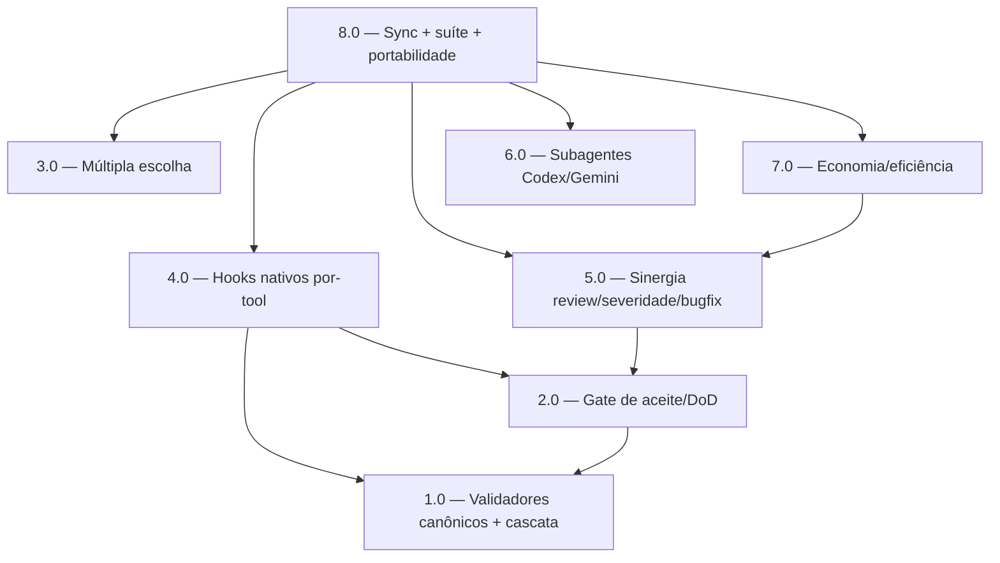

<!-- spec-hash-prd: bb49d3f0bee58af3d4c8361265864995a94e2f11698da0e410f3fe1bd9b7f349 -->
<!-- spec-hash-techspec: e7a7cb66729b105e0b0a317920854e14a8c71cdc1ecf13521367aca7352e31a3 -->

# Resumo das Tarefas de Implementação para Skills Production-Proof + Paridade Cross-CLI 2026

## Metadados
- **PRD:** `.specs/prd-skills-production-proof/prd.md`
- **Especificação Técnica:** `.specs/prd-skills-production-proof/techspec.md`
- **Total de tarefas:** 8
- **Tarefas paralelizáveis:** {1.0 ‖ 3.0}, {2.0 ‖ 3.0}, {4.0 ‖ 6.0}, {5.0 ‖ 6.0}

## Tarefas

| # | Título | Status | Dependências | Paralelizável | Skills |
|---|--------|--------|-------------|---------------|--------|
| 1.0 | Validadores canônicos em `.agents/scripts/` + resolução em cascata | pending | — | Com 3.0 | — |
| 2.0 | Gate de aceite/DoD: template + validate-task-evidence.sh + DiffSHA default-on | pending | 1.0 | Com 3.0 | — |
| 3.0 | Protocolo de múltipla escolha: referência + integração nas skills | pending | — | Com 1.0, 2.0 | — |
| 4.0 | Hooks nativos por-tool + sandbox/approval Codex + matriz + sync gate | pending | 1.0, 2.0 | Com 6.0 | — |
| 5.0 | Sinergia: review confronta aceite + severidade + bugfix path cascade | pending | 2.0 | Com 6.0 | — |
| 6.0 | Subagentes Codex/Gemini: validação empírica + agent files | pending | — | Com 4.0, 5.0 | — |
| 7.0 | Economia: RF default-on + skills via metadado + validador review + budget/kill | pending | 5.0 | — | — |
| 8.0 | Sync mirrors + suíte + portabilidade cross-CLI + governança | pending | 3.0, 4.0, 5.0, 6.0, 7.0 | — | analyze-project |
## Dependências Críticas
- **1.0 → 2.0, 4.0:** o canônico em `.agents/scripts/` e a cascata são pré-requisito do gate de
  aceite (2.0) e dos hooks que invocam os validadores (4.0).
- **2.0 → 4.0, 5.0:** o gate de aceite define o validador que os hooks chamam (4.0) e que `review`
  confronta (5.0).
- **5.0 → 7.0:** o validador de `review` (7.0) depende das mudanças de confronto de aceite (5.0).
- **3.0–7.0 → 8.0:** sync dos mirrors, suíte e portabilidade dependem de todas as mudanças prontas.

## Riscos de Integração
- **Mover validadores (1.0):** callers que assumem `.claude/scripts/` quebram; mitigar com mirror
  funcional + grep de callers; gate `check-scripts-sync`.
- **Gate de aceite em tasks legadas (2.0):** ausência de `## Critérios de Sucesso/Aceite` deve ser
  não-fatal (aviso), preservando comportamento atual (RF-22).
- **Formatos de hook divergentes (4.0):** cobrir cada tool com fixture; Codex sempre com
  sandbox/approval (lacuna de route-around).
- **DiffSHA default-on (2.0):** garantir que não altere contagem de eventos; opt-out via `=0`.
- **Subagentes (6.0):** binários Codex/Gemini podem faltar no ambiente; registrar suposição e
  documentar execução inline.

## Cobertura de Requisitos

| Tarefa | Requisitos cobertos |
|--------|-------------------|
| 1.0 | RF-09, RF-17 (parcial: cascata) |
| 2.0 | RF-01, RF-02, RF-03, RF-04 |
| 3.0 | RF-06, RF-07, RF-08 |
| 4.0 | RF-05, RF-10, RF-11, RF-12, RF-13 |
| 5.0 | RF-14, RF-15, RF-17 (bugfix path) |
| 6.0 | RF-16 |
| 7.0 | RF-18, RF-19, RF-20, RF-21 |
| 8.0 | RF-22, RF-23 + sync/validação/governança (matriz de projetos pequeno/médio/grande, novo/existente) |

## Grafo de Dependencias

## Legenda de Status
- `pending`: aguardando execução
- `in_progress`: em execução
- `needs_input`: aguardando informação do usuário
- `blocked`: bloqueado por dependência ou falha externa
- `failed`: falhou após limite de remediação
- `done`: completado e aprovado
