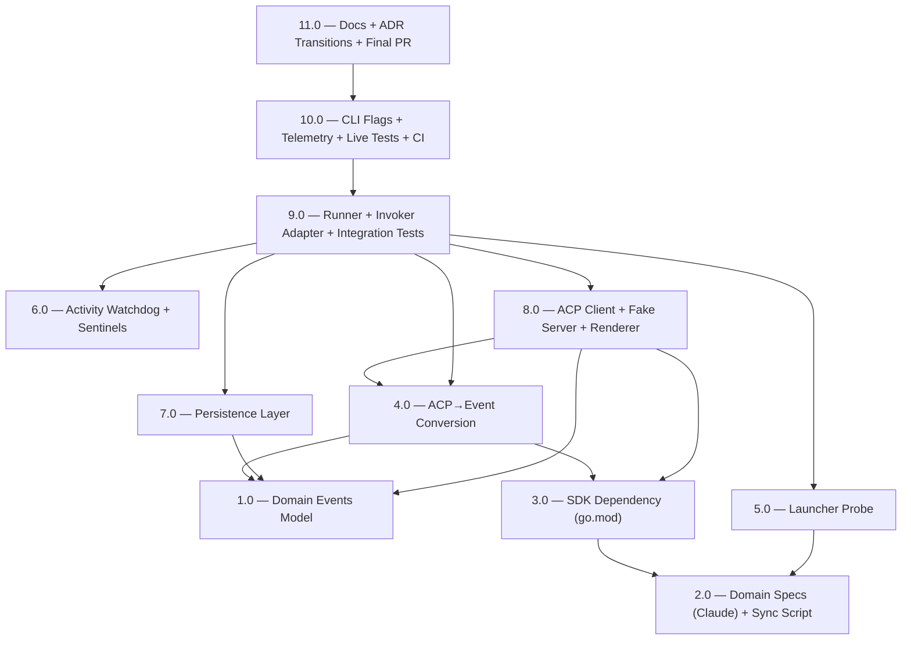

<!-- spec-hash-prd: b5b59cad50a700d64f42aadb262086e4fee7011730a2164db9279afefa59e582 -->
<!-- spec-hash-techspec: 30f5b5bd1aadc764d30cf244f087168b2fe756348ceb5e7d61dd52d4688099ff -->

# Resumo das Tarefas de Implementação — ACP Runtime para Claude

## Metadados

- **PRD:** `tasks/prd-acp-runtime-claude/prd.md`
- **Especificação Técnica:** `tasks/prd-acp-runtime-claude/techspec.md`
- **Total de tarefas:** 11
- **Tarefas paralelizáveis:** 1.0 ∥ 2.0 ∥ 6.0; 3.0 ∥ 5.0 ∥ 7.0; 4.0 ∥ 5.0 ∥ 7.0
- **Estratégia de entrega:** branch único `feat/acp-runtime-claude`; 1 commit semântico por task; 1 PR no fim agrupando 11 commits (decisão #33).
- **Tool de execução sugerida:** `claude` (decisão #34).
- **Modo de execução:** `execute-task` manual, validando entre tasks (decisão #35).

## Tarefas

<!-- Colunas e formato canônico (MANDATÓRIO):
     - `#`: id decimal `X.Y` (sempre X.0 para tarefas de topo).
     - `Status`: ^(pending|in_progress|needs_input|blocked|failed|done)$
     - `Dependências`: ^(—|\d+\.\d+(,\s*\d+\.\d+)*)$  (em-dash unicode quando vazio)
     - `Paralelizável`: ^(—|Não|Com\s+\d+\.\d+(,\s*\d+\.\d+)*)$
     - `Skills`: skills processuais extras (descoberta agnóstica em `.agents/skills/`). Use `—` quando
       não houver. Nunca listar skills auto-carregadas (governance/linguagem) nem `*-implementation`. -->

| # | Título | Status | Dependências | Paralelizável | Skills |
|---|--------|--------|-------------|---------------|--------|
| 1.0 | Domain Events Model | done | — | Com 2.0, 6.0 | — |
| 2.0 | Domain Specs (Claude) + Sync Script | done | — | Com 1.0, 6.0 | — |
| 3.0 | SDK Dependency (go.mod) | done | 2.0 | Com 5.0, 7.0 | — |
| 4.0 | ACP→Event Conversion | done | 1.0, 3.0 | Com 5.0, 7.0 | — |
| 5.0 | Launcher Probe | done | 2.0 | Com 3.0, 6.0, 7.0 | — |
| 6.0 | Activity Watchdog + Sentinels | done | — | Com 1.0, 2.0, 7.0 | — |
| 7.0 | Persistence Layer (JSONL + Report + ToolCalls) | done | 1.0 | Com 3.0, 5.0, 6.0 | — |
| 8.0 | ACP Client + Fake Server + Renderer | done | 1.0, 3.0, 4.0 | — | — |
| 9.0 | Application Runner + Invoker Adapter + Integration Tests | done | 4.0, 5.0, 6.0, 7.0, 8.0 | — | — |
| 10.0 | CLI Flags + Telemetry + Live Tests + CI Workflow | pending | 9.0 | — | — |
| 11.0 | Docs + ADR Transitions + Final PR | pending | 10.0 | — | finalize-changelog-readme-push, pull-request |

## Dependências Críticas

- **3.0 bloqueia 4.0 e 8.0:** sem `coder/acp-go-sdk` no `go.mod`, conversão e client não compilam.
- **2.0 bloqueia 5.0:** `probe.EnsureAvailable` consome `specs.Claude()` para resolver binário/npx.
- **1.0 + 3.0 bloqueiam 4.0:** conversão precisa do tipo `events.Event` e do SDK.
- **4.0 + 5.0 + 6.0 + 7.0 + 8.0 bloqueiam 9.0:** runner orquestra todos esses componentes.
- **9.0 bloqueia 10.0:** CLI só faz sentido após o runner estar funcional e testado.
- **10.0 bloqueia 11.0:** docs e ADR final só fecham com código completo no branch.

## Riscos de Integração

- **Justificativa para 11 tarefas (acima do default 10):** consolidar 10.0 (CLI + telemetria + live + CI) com 11.0 (docs + ADR + PR) violaria a regra "uma responsabilidade por task" — concerns ortogonais (código backend vs. documentação/PR). Cada task vira um commit atômico no branch único; 11 commits semânticos são revisáveis, um commit composto não é. Decisão registrada com o usuário (resposta a `create-tasks` Etapa 3).
- **3.0 isolada por muito tempo:** se 4.0 e 8.0 demorarem, `go mod tidy` pode falhar em CI por dependência não usada. Mitigação: ordem topológica respeitada, 4.0 entra imediatamente após 3.0.
- **8.0 acumula 3 responsabilidades (client + fake + renderer):** afinidade de camada (toda infra de transport+output); cada subcomponente tem tests separados. Aceito por coesão de camada, não de tipo.
- **9.0 é o ponto único de falha de integração:** se domínio (1.0) ou conversão (4.0) saírem mal-desenhados, refactor cascateia. Mitigação: `make verify` é gate por task; revisão extra entre 1.0 e 4.0.
- **`acpfake` em 8.0 deve refletir comportamento real:** drift entre fake e `claude-agent-acp` real só aparece em 10.0 (live tests). Mitigação: golden fixtures em 4.0 capturam payloads reais para evitar suposições.
- **Live test em 10.0 com build tag `acp_live`:** sem CI executando, drift do SDK passa despercebido até alguém rodar localmente. Mitigação: 10.0 inclui job nightly opcional no workflow.

## Cobertura de Requisitos

| Tarefa | Requisitos cobertos |
|--------|-------------------|
| 1.0 | RF-05 (tipos de evento, kind=unknown), RF-08 (envelope MarshalJSON), RF-10 (CancelReason) |
| 2.0 | RF-03 (versão npm pinada), restrições de segurança (constante Go pinada) |
| 3.0 | Restrição "SDK pinado em última stable tagged" |
| 4.0 | RF-04 (consumo de SessionUpdate), RF-05 (conversão para Event) |
| 5.0 | RF-03 (EnsureAvailable PATH→npx@VER→fail) |
| 6.0 | RF-06 (watchdog cancela em activity_timeout), RF-07 (--activity-timeout 0 desabilita), sentinel para RF-16 |
| 7.0 | RF-08 (events.jsonl), RF-09 (tool_calls.md), RF-10 (execution_report.md enriquecido) |
| 8.0 | RF-04 (client ACP via SDK), RF-11 (renderer humano), RF-13 (acpfake) |
| 9.0 | RF-04, RF-05, RF-08–RF-11, RF-12 (legacy intocado), RF-13 (integration via acpfake), RF-16 (permission_denied) |
| 10.0 | RF-01 (flag --runtime), RF-02 (--tool=claude obrigatório), RF-07 (--activity-timeout), RF-11 (--quiet), RF-14 (live tests + build tag) |
| 11.0 | RF-15 (ADR-009 e ADR-010 Aceita); restrições de observabilidade e segurança documentadas |

## Grafo de Dependências

## Legenda de Status

- `pending`: aguardando execução
- `in_progress`: em execução
- `needs_input`: aguardando informação do usuário
- `blocked`: bloqueado por dependência ou falha externa
- `failed`: falhou após limite de remediação
- `done`: completado e aprovado
