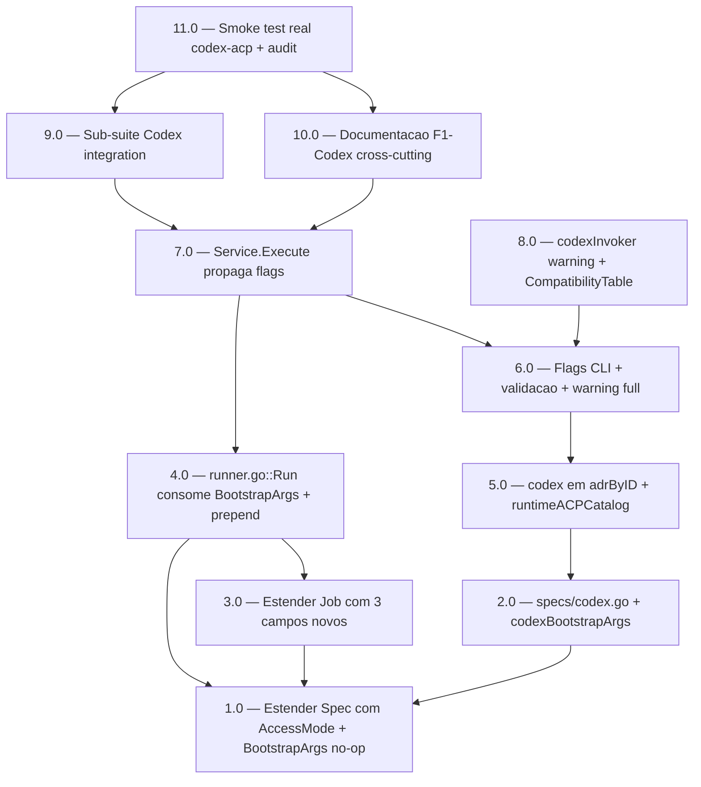

<!-- spec-hash-prd: f9def8f435e54e04e587ce2cb4581749c988b30798c006333ca870a614153ad8 -->
<!-- spec-hash-techspec: 5de95b5748fbd2798cc405088c7f4707a1266e73150e679d3726e1c534cf40fe -->

# Resumo das Tarefas de Implementação para Codex CLI via ACP Nativo

## Metadados
- **PRD:** `tasks/prd-codex-acp-spec/prd.md`
- **Especificação Técnica:** `tasks/prd-codex-acp-spec/techspec.md`
- **ADR material:** `tasks/adr/013-codex-cli-acp-native.md`
- **Insumo de pesquisa:** `docs/research/compozy-adaptation-codex-2026.md`
- **Precedente direto:** `tasks/prd-copilot-acp-spec/` (F1-Copilot — generalização runtime base)
- **Total de tarefas:** 11
- **Tarefas paralelizáveis:** 2.0 ↔ 3.0 (após 1.0); 9.0 ↔ 10.0 (após 7.0)

## Tarefas

<!-- Colunas e formato canônico (MANDATÓRIO):
     - `#`: id decimal `X.Y` (sempre X.0 para tarefas de topo).
     - `Status`: ^(pending|in_progress|needs_input|blocked|failed|done)$
     - `Dependências`: ^(—|\d+\.\d+(,\s*\d+\.\d+)*)$  (em-dash unicode quando vazio)
     - `Paralelizável`: ^(—|Não|Com\s+\d+\.\d+(,\s*\d+\.\d+)*)$
     - `Skills`: skills processuais extras (descoberta agnóstica em `.agents/skills/`). Use `—` quando
       não houver. Nunca listar skills auto-carregadas (governance/linguagem) nem `*-implementation`.
     - `Fase` (OPCIONAL): inteiro positivo para agrupamento visual de fases de entrega. Pode ser
       omitida em PRDs pequenos; `execute-all-tasks` não consome esta coluna. Se incluída, mantenha
       em todas as linhas para não quebrar o parser de tabela markdown. -->

| # | Título | Status | Dependências | Paralelizável | Skills |
|---|--------|--------|--------------|---------------|--------|
| 1.0 | Estender Spec com AccessMode + BootstrapArgs default no-op | done | — | — | — |
| 2.0 | Criar specs/codex.go com Codex() + codexBootstrapArgs + testes | done | 1.0 | Com 3.0 | — |
| 3.0 | Estender Job com ReasoningEffort/AccessMode/AddDirs | done | 1.0 | Com 2.0 | — |
| 4.0 | runner.go::Run consome spec.BootstrapArgs e prepend ao argv | done | 1.0, 3.0 | Não | — |
| 5.0 | Registrar codex em adrByID e runtimeACPCatalog | done | 2.0 | Não | — |
| 6.0 | Flags --reasoning-effort + --access-mode + validação enum + warning full | done | 5.0 | Não | — |
| 7.0 | Service.Execute propaga ReasoningEffort/AccessMode/AddDirs | done | 4.0, 6.0 | Não | — |
| 8.0 | Codex compat em taskloop: codexInvoker warning + CompatibilityTable | done | 6.0 | — | — |
| 9.0 | Sub-suite Codex em acp_integration_test.go reusando fake server | done | 7.0 | Com 10.0 | — |
| 10.0 | Documentação F1-Codex cross-cutting (CODEX.md, AGENTS.md, cli-schema, telemetria) | done | 7.0 | Com 9.0 | — |
| 11.0 | Smoke test real codex-acp + captura audit/ | done | 9.0, 10.0 | — | — |

## Dependências Críticas

- **1.0 é gate de regressão Claude/Copilot (R-01 crítico)**: estender interface `Spec` com `AccessMode` + `BootstrapArgs` no-op default. `claude_test.go`, `copilot_test.go`, `spec_test.go` devem permanecer 100% verdes antes de avançar para 2.0/3.0. Default `bootstrapArgs == nil` retorna `nil` em `Spec.BootstrapArgs(...)` — testes T-05/T-10/T-11 validam.
- **4.0 carrega invariante forense (R-08 crítico)**: `runner.go::Run` muda assinatura do argv (prepend de `BootstrapArgs`). **Diff zero** obrigatório em `internal/runtime/persistence/*`, `internal/runtime/watchdog.go`, `internal/runtime/client/*`. Validar via `git diff --stat` antes de avançar para 5.0.
- **5.0 é precondição cirúrgica do wire-up**: registrar `"codex"` em `adrByID` (probe) e `runtimeACPCatalog` (CLI) é o ponto que destrava 6.0/7.0/8.0. Sem ela, gate em `task_loop.go:82-97` continua rejeitando Codex.
- **6.0 carrega validação enum + warning full (R-03 alto)**: `--reasoning-effort {low,medium,high}` e `--access-mode {restricted,full}` validados antes de propagar. T-24/T-25 cobrem casos inválidos. Warning único via `sync.Once` para `--access-mode=full` (T-30) é obrigatório.
- **7.0 é gate de regressão CLI**: T-14 invertido (Codex aceito) + T-15 novo (combinação completa) + T-26 (Claude regressão com flags Codex ignoradas via no-op).
- **9.0 é gate de paridade observacional**: reusa o fake ACP server existente para validar que `events.jsonl`/`tool_calls.md`/`execution_report.md` saem com a mesma estrutura que Claude/Copilot, e que spawn args carregam os `-c` overrides esperados (T-17/T-18/T-19).
- **11.0 é gate final E2E**: smoke real com `codex-acp` produz evidência forense em `audit/`. Sem isso, paridade observacional não está validada fora do fake server.

## Riscos de Integração

- **Justificativa para 11 tarefas (acima do default 10)**: F1-Codex apresenta superfície estruturalmente maior que F1-Copilot por exigir (a) extensão da interface `Spec` com `BootstrapArgs(...)` como gate de regressão Claude/Copilot dedicado (1.0); (b) duas flags CLI novas com validação enum + warning para `--access-mode=full` (6.0); (c) propagação cross-layer de 3 campos novos em `Job` (3.0/4.0/7.0). Consolidar abaixo de 11 violaria "uma responsabilidade por task" — tentativa de mesclar 9.0 (sub-suite automatizada) com 11.0 (smoke manual) misturaria testes em CI com validação E2E real, escondendo o gate final.

- **R-01 (crítico)**: regressão Claude/Copilot ao estender interface `Spec`. Tarefa 1.0 carrega gate explícito: `claude_test.go` + `copilot_test.go` + `spec_test.go` 100% verdes antes de avançar para 2.0/3.0. `BootstrapArgs(...)` no-op (`bootstrapArgs == nil`) retorna `nil` — testes T-10/T-11 validam.
- **R-08 (crítico)**: quebra silenciosa de invariantes forenses ao mudar `runner.go::Run`. Tarefas 4.0 e 7.0 carregam revisão obrigatória do diff em `internal/runtime/persistence/*`, `internal/runtime/watchdog.go`, `internal/runtime/client/*` (deve ser **zero linhas**). Falha desse critério bloqueia merge.
- **R-03 (alto)**: `--access-mode=full` usado acidentalmente em ambiente compartilhado. Tarefa 6.0 implementa warning único em stderr via `sync.Once`. Default permanece `restricted`. Documentação em `CODEX.md` (tarefa 10.0) explícita sobre risco.
- **Paralelismo 2.0 ↔ 3.0**: arquivos disjuntos (`specs/codex.go` vs `runtime/runner.go::Job`); ambas dependem apenas de 1.0. Seguro paralelizar.
- **Paralelismo 9.0 ↔ 10.0**: arquivos disjuntos (testes vs docs); ambas dependem de 7.0. Seguro paralelizar.
- **Constantes confirmadas em 2026-05-21**: `CodexNpmVersion = "0.14.0"` validado via `npm view @zed-industries/codex-acp versions` — versões publicadas `[..., 0.12.0, 0.13.0, 0.14.0]`. `CodexMinNpmVersion = "0.12.0"` informacional (mínimo do compozy para `gpt-5.5`).
- **Caminho legado preservado por 2 versões minor**: `codexInvoker` em `internal/taskloop/agent.go:335-351` permanece operacional via decisão D-05. Tarefa 8.0 garante warning único; remoção é decisão de versão futura, fora deste PRD.
- **Smoke test (11.0) requer `codex-acp` instalado**: ambiente local em 2026-05-21 não tem o binário (`which codex-acp` retorna not found); apenas o CLI legado `codex` v0.132.0 está presente. Operador deve `npm install -g @zed-industries/codex-acp@0.14.0` antes do smoke OU confiar no fallback `npx` automático. CI cobre apenas matriz com fake server (9.0).
- **Tool name aliasing adiado para F2-Codex**: telemetria Codex usará nomes nativos (`search_query`, `image_query`) — dashboards multi-tool que filtram por `web_search` canônico verão divergência. Decisão D-09 do techspec; risco R-06 aceito.

## Cobertura de Requisitos

| Tarefa | Requisitos cobertos | Casos de teste (techspec) |
|--------|---------------------|---------------------------|
| 1.0 | RF-04, RF-05; preserva A5 | T-05, T-10, T-11, T-19 |
| 2.0 | RF-01, RF-02, RF-03, RF-06, RF-18 | T-01, T-02, T-03, T-04, T-06, T-07, T-08, T-09, T-12 |
| 3.0 | RF-07 | T-19 (regressão Claude) |
| 4.0 | RF-08, RF-19 | T-17, T-18, T-19, T-31 |
| 5.0 | RF-12, RF-14 | T-13, T-14, T-15, T-16, T-22 |
| 6.0 | RF-09, RF-10, RF-11, RF-13 | T-22, T-23, T-24, T-25, T-30 |
| 7.0 | RF-15, RF-26 | T-26, T-27 |
| 8.0 | RF-16, RF-24 | T-28, T-29, T-34, T-35 |
| 9.0 | RF-17, RF-27 | T-17, T-18, T-19, T-20, T-21 |
| 10.0 | RF-20, RF-21, RF-22, RF-23 | — (validação documental) |
| 11.0 | RF-19 (gate final), OB-02, OB-06 | smoke manual + suíte completa (T-31, T-32, T-33) |

## Grafo de Dependencias

## Legenda de Status
- `pending`: aguardando execução
- `in_progress`: em execução
- `needs_input`: aguardando informação do usuário
- `blocked`: bloqueado por dependência ou falha externa
- `failed`: falhou após limite de remediação
- `done`: completado e aprovado
